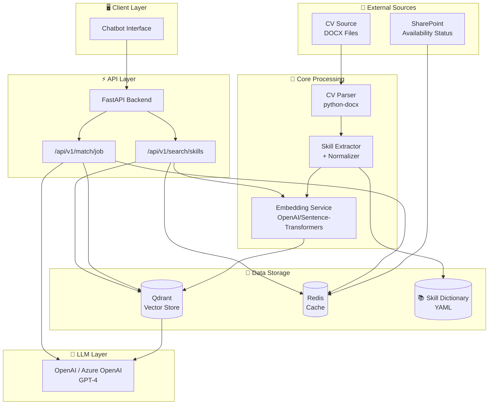
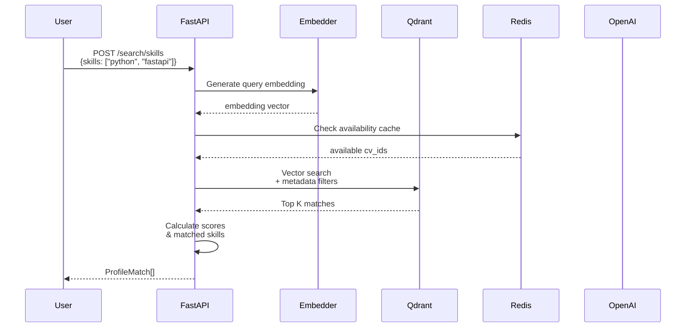
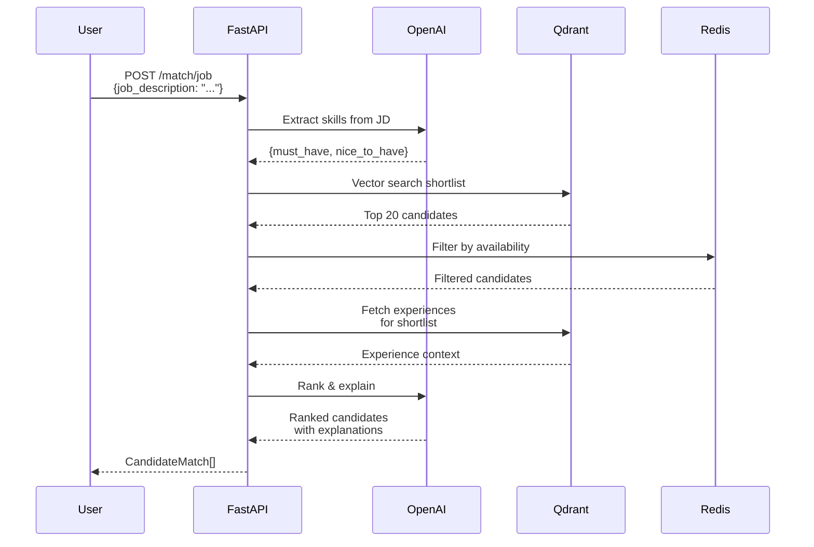
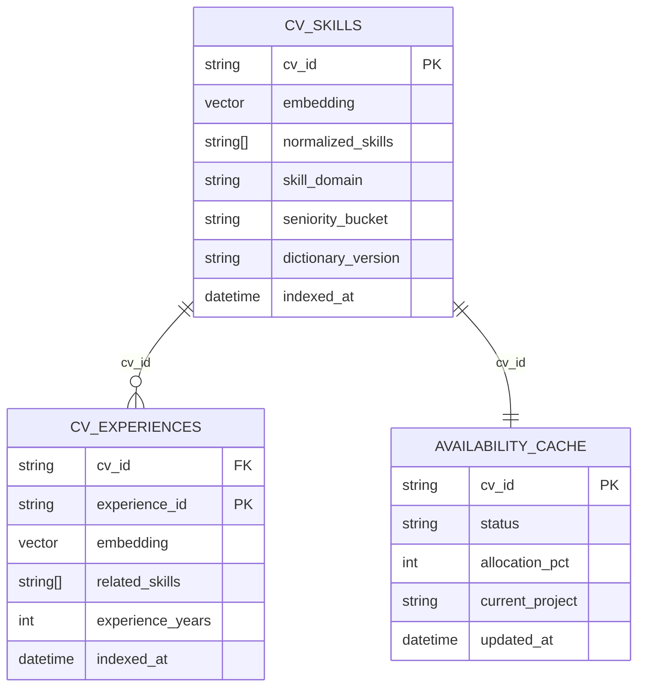
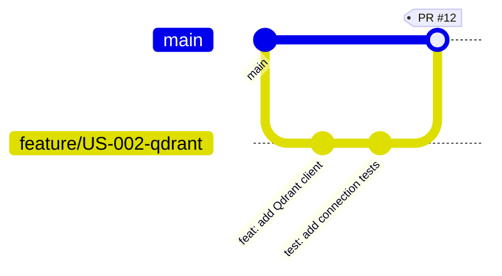

# ProfileBot

Sistema AI per il matching di profili professionali basato su competenze (skill-first approach).

## Descrizione

ProfileBot è un'applicazione aziendale che permette la ricerca e analisi dei profili interni, combinando:
- **Curriculum** (docx) con esperienze e skill in formato keyword
- **Stato operativo** (disponibilità/allocazione) da fonti esterne

### Funzionalità MVP

1. **Ricerca profili per skill** - Trovare profili in base a competenze specifiche
2. **Analisi disponibilità** - Identificare profili disponibili, parzialmente allocati o liberi
3. **Match con job description** - Trovare il miglior profilo per una posizione specifica

---

## Architettura

### System Architecture



### Data Flow - Search by Skills



### Data Flow - Job Description Match



### Qdrant Collections



---

## Stack Tecnologico

| Componente | Tecnologia |
|------------|------------|
| Backend | Python 3.11+ |
| Package Manager | [uv](https://github.com/astral-sh/uv) |
| RAG Framework | LlamaIndex |
| Vector Store | Qdrant |
| LLM | OpenAI / Azure OpenAI |
| Cache | Redis |
| API | FastAPI |

---

## Quick Start

```bash
# Clone repository
git clone https://github.com/giamma80/profilebot.git
cd profilebot

# Setup dev environment (richiede uv installato)
make dev

# Oppure manualmente:
uv venv
uv pip install -e ".[dev]"
uv run pre-commit install

# Configure
cp .env.example .env
# Edit .env with your settings

# Start services
make docker-up    # Qdrant + Redis

# Run API
make run
```

### Docker build exclusions

Le build Docker escludono file e directory locali/temporanei tramite `.dockerignore`.
Esempi esclusi: `.venv`, `__pycache__`, `.env*`, `qdrant_storage/`, `redis_data/`, `logs/`, `.git/`.
Questo evita di includere segreti o artefatti di sviluppo nelle immagini.

---

## Development Workflow

### Git Flow

Ogni User Story deve avere un **feature branch dedicato**:

```
feature/US-XXX-descrizione-breve
```

**Workflow:**
1. Crea branch da `main`
2. Sviluppa con commit atomici (Conventional Commits)
3. Push e apri Pull Request
4. Code review + CI green
5. Squash merge su main



### Branch Types

| Prefix | Uso |
|--------|-----|
| `feature/` | User Stories |
| `bugfix/` | Bug fixes |
| `hotfix/` | Fix urgenti |
| `docs/` | Documentazione |

### Commit Convention

```bash
feat(parser): add DOCX text extraction
fix(qdrant): handle connection timeout
test(skills): add normalization tests
docs: update API documentation
```

📖 **Vedi [CONTRIBUTING.md](docs/CONTRIBUTING.md) per dettagli completi**

---

## Makefile Commands

```bash
# Setup
make install      # Install production dependencies
make dev          # Install dev dependencies + pre-commit hooks

# Code Quality
make lint         # Run fast linters (ruff + flake8 + mypy)
make lint-all     # Run ALL linters (+ pylint)
make pylint       # Run only pylint
make format       # Format code (black + isort + ruff --fix)
make check        # Run all checks (lint + format check)
make api-lint     # Lint OpenAPI spec with Spectral

# Testing
make test         # Run tests with pytest
make test-cov     # Run tests with coverage report

# Run
make run          # Start API server (uvicorn)
make docker-up    # Start Qdrant + Redis
make docker-down  # Stop Docker services

# Cleanup
make clean        # Remove cache and build files
```

---

## Code Quality Stack

| Tool | Purpose | Command |
|------|---------|---------|
| **ruff** | Fast linter (Rust-based) | `make lint` |
| **flake8** | PEP8 compliance | `make lint` |
| **pylint** | Deep static analysis | `make pylint` |
| **mypy** | Type checking | `make lint` |
| **black** | Code formatter | `make format` |
| **isort** | Import sorting | `make format` |
| **bandit** | Security scanning | CI only |
| **spectral** | OpenAPI linting | `make api-lint` |

---

## CI/CD

GitHub Actions pipeline runs on every push/PR:

- **Lint & Format** - ruff, flake8, black, isort, mypy, pylint
- **Tests** - pytest with coverage
- **Security** - bandit security scan

---

## Project Structure

```
profilebot/
├── src/
│   ├── api/              # FastAPI endpoints
│   │   └── v1/           # API version 1
│   ├── core/             # Core business logic
│   │   ├── parser/       # CV parsing
│   │   ├── skills/       # Skill extraction
│   │   └── indexing/     # Embedding pipeline
│   ├── services/         # External services
│   │   ├── qdrant/       # Vector store
│   │   ├── embedding/    # Embedding generation
│   │   └── availability/ # Status service
│   └── utils/            # Utilities
├── data/
│   └── skills_dictionary.yaml
├── tests/                # Test suite
├── docs/                 # Documentation
├── scripts/              # Utility scripts
├── .github/
│   ├── workflows/        # CI/CD pipelines
│   └── ISSUE_TEMPLATE/
├── Makefile              # Project automation
├── pyproject.toml        # Dependencies & tool config
├── docker-compose.yml
└── .pre-commit-config.yaml
```

---

## User Stories MVP

| ID | Titolo | Sprint | Priority |
|----|--------|--------|----------|
| US-001 | Setup Repository e CI/CD | 1 | P0 |
| US-002 | Setup Qdrant Vector Store | 1 | P0 |
| US-003 | Parser CV DOCX | 1 | P0 |
| US-004 | Skill Extraction e Normalizzazione | 2 | P0 |
| US-005 | Embedding e Indexing Pipeline | 2 | P0 |
| US-006 | API Ricerca Profili per Skill | 3 | P1 |
| US-007 | Filtro Disponibilità | 3 | P1 |
| US-008 | Match con Job Description | 4 | P1 |

📖 **Vedi [USER_STORIES_DETAILED.md](docs/USER_STORIES_DETAILED.md) per specifiche complete**

---

## Team

| Ruolo | Responsabilità |
|-------|----------------|
| Product Owner | Priorità backlog, requisiti business |
| Solution Architect | Architettura, decisioni tecniche |
| Data Scientist | Pipeline ML, embedding, ottimizzazione |
| Backend Developer | API, integrations, core logic |
| Frontend Developer | UI/UX chatbot interface |

---

## Documentation

- [User Stories Dettagliate](docs/USER_STORIES_DETAILED.md)
- [Contributing Guide](docs/CONTRIBUTING.md)
- [Analisi Preliminare](docs/analisi_preliminare.md)
- [Appendice Tecnica - Indexing](docs/Appendice%20tecnica%20—%20Indexing.md)
- [Team Structure](docs/TEAM_STRUCTURE.md)
- [Product Backlog](docs/BACKLOG.md)

---

## License

Proprietario - Uso interno aziendale
