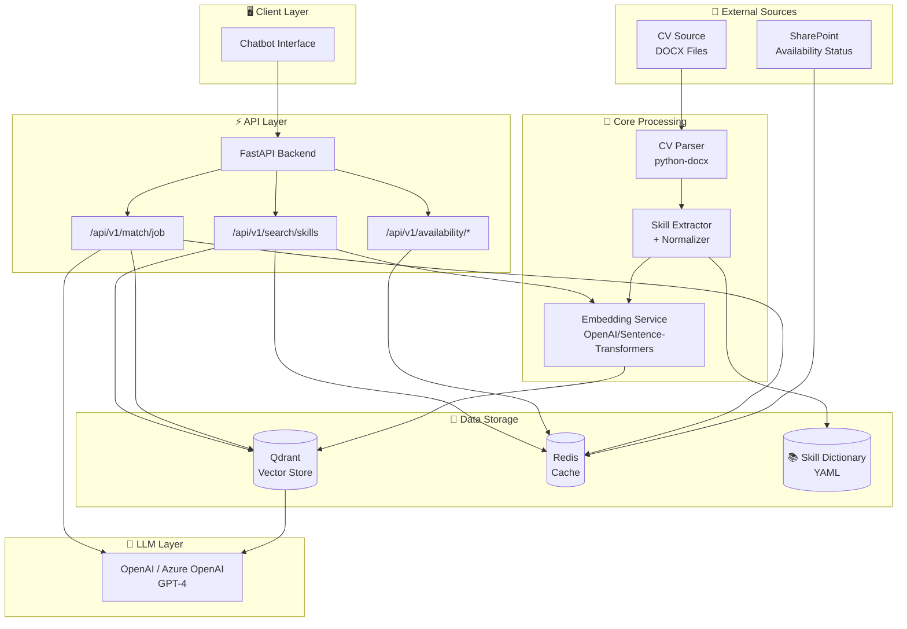
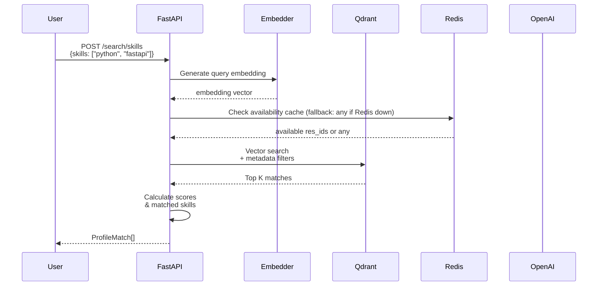
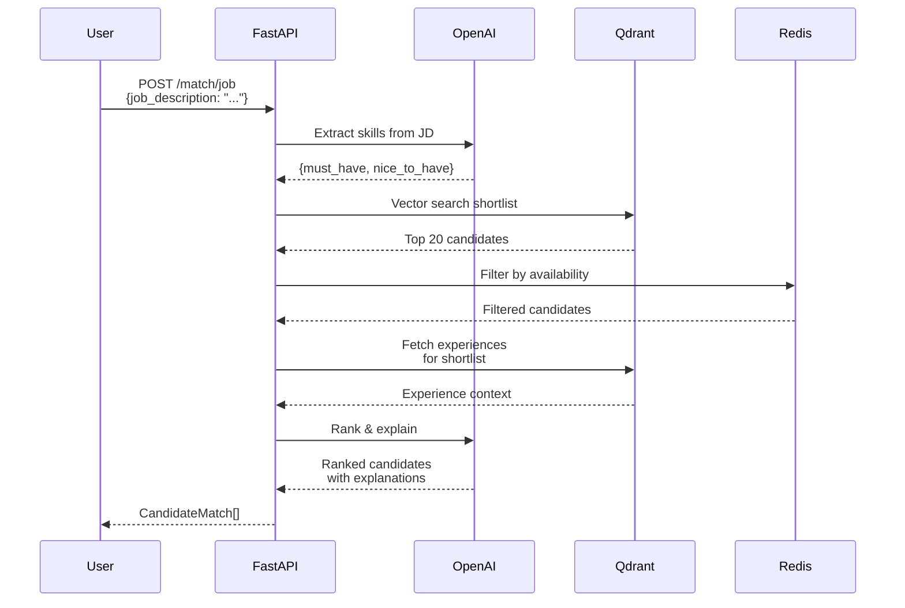
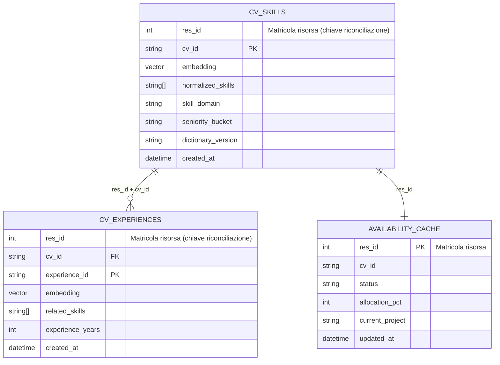
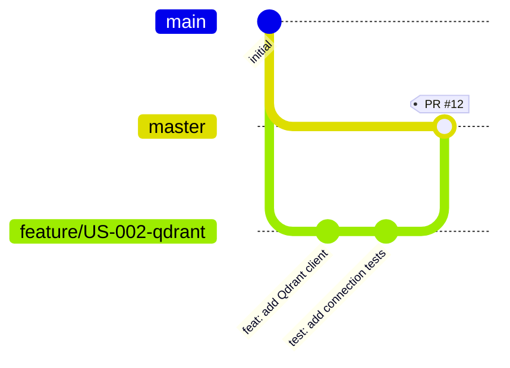

# ProfileBot


Sistema AI per il matching di profili professionali basato su competenze (skill-first approach).

## Descrizione

ProfileBot è un'applicazione aziendale che permette la ricerca e analisi dei profili interni, combinando:
- **Curriculum** (docx) con esperienze e skill in formato keyword
- **Stato operativo** (disponibilità/allocazione) da fonti esterne

### Funzionalità MVP

1. **Ricerca profili per skill** - Trovare profili in base a competenze specifiche
2. **Analisi disponibilità** - Identificare profili disponibili, parzialmente allocati o liberi
3. **Match con job description** - Trovare il miglior profilo per una posizione specifica

---

## Architettura

### System Architecture


```mermaid
flowchart TB
    subgraph Client["🖥️ Client Layer"]
        UI[Chatbot Interface]
    end

    subgraph API["⚡ API Layer"]
        FastAPI[FastAPI Backend]
        SearchAPI["/api/v1/search/skills"]
        AvailabilityAPI["/api/v1/availability/*"]
        MatchAPI["/api/v1/match/job"]
    end

    subgraph Core["🧠 Core Processing"]
        Parser[CV Parser<br/>python-docx]
        SkillExtractor[Skill Extractor<br/>+ Normalizer]
        Embedder[Embedding Service<br/>OpenAI/Sentence-Transformers]
    end

    subgraph Storage["💾 Data Storage"]
        Qdrant[(Qdrant<br/>Vector Store)]
        Redis[(Redis<br/>Cache)]
        SkillDict[("📚 Skill Dictionary<br/>YAML")]
    end

    subgraph External["🔗 External Sources"]
        SharePoint[SharePoint<br/>Availability Status]
        CVSource[CV Source<br/>DOCX Files]
    end

    subgraph LLM["🤖 LLM Layer"]
        OpenAI[OpenAI / Azure OpenAI<br/>GPT-4]
    end

    UI --> FastAPI
    FastAPI --> SearchAPI
    FastAPI --> AvailabilityAPI
    FastAPI --> MatchAPI

    SearchAPI --> Embedder
    SearchAPI --> Qdrant
    SearchAPI --> Redis

    AvailabilityAPI --> Redis

    MatchAPI --> OpenAI
    MatchAPI --> Qdrant
    MatchAPI --> Redis

    CVSource --> Parser
    Parser --> SkillExtractor
    SkillExtractor --> SkillDict
    SkillExtractor --> Embedder
    Embedder --> Qdrant

    SharePoint --> Redis

    Qdrant --> OpenAI
```

### Data Flow - Search by Skills


```mermaid
sequenceDiagram
    participant U as User
    participant API as FastAPI
    participant E as Embedder
    participant Q as Qdrant
    participant R as Redis
    participant LLM as OpenAI

    U->>API: POST /search/skills<br/>{skills: ["python", "fastapi"]}
    API->>E: Generate query embedding
    E-->>API: embedding vector

    API->>R: Check availability cache (fallback: any if Redis down)
    R-->>API: available res_ids or any

    API->>Q: Vector search<br/>+ metadata filters
    Q-->>API: Top K matches

    API->>API: Calculate scores<br/>& matched skills
    API-->>U: ProfileMatch[]
```

### Data Flow - Job Description Match


```mermaid
sequenceDiagram
    participant U as User
    participant API as FastAPI
    participant LLM as OpenAI
    participant Q as Qdrant
    participant R as Redis

    U->>API: POST /match/job<br/>{job_description: "..."}

    API->>LLM: Extract skills from JD
    LLM-->>API: {must_have, nice_to_have}

    API->>Q: Vector search shortlist
    Q-->>API: Top 20 candidates

    API->>R: Filter by availability
    R-->>API: Filtered candidates

    API->>Q: Fetch experiences<br/>for shortlist
    Q-->>API: Experience context

    API->>LLM: Rank & explain
    LLM-->>API: Ranked candidates<br/>with explanations

    API-->>U: CandidateMatch[]
```

### Qdrant Collections

> **Nota:** `res_id` (matricola risorsa) è la **chiave di riconciliazione** per tutte le fonti dati.
> Ogni punto in Qdrant include `res_id` per consentire join cross-source.


```mermaid
erDiagram
    CV_SKILLS {
        int res_id "Matricola risorsa (chiave riconciliazione)"
        string cv_id PK
        vector embedding
        string[] normalized_skills
        string skill_domain
        string seniority_bucket
        string dictionary_version
        datetime created_at
    }

    CV_EXPERIENCES {
        int res_id "Matricola risorsa (chiave riconciliazione)"
        string cv_id FK
        string experience_id PK
        vector embedding
        string[] related_skills
        int experience_years
        datetime created_at
    }

    AVAILABILITY_CACHE {
        int res_id PK "Matricola risorsa"
        string cv_id
        string status
        int allocation_pct
        string current_project
        datetime updated_at
    }

    CV_SKILLS ||--o{ CV_EXPERIENCES : "res_id + cv_id"
    CV_SKILLS ||--|| AVAILABILITY_CACHE : "res_id"
```

---

## Stack Tecnologico

| Componente | Tecnologia |
|------------|------------|
| Backend | Python 3.11+ |
| Package Manager | [uv](https://github.com/astral-sh/uv) |
| RAG Strategy | Custom (Qdrant + OpenAI + retrieval + prompt) |
| Vector Store | Qdrant |
| LLM | OpenAI / Azure OpenAI |
| Embedding | `text-embedding-3-small` (1536 dim) |
| Cache/Broker | Redis |
| Job Queue | Celery |
| Monitoring | Flower |
| API | FastAPI |

---

## RAG Strategy

Il sistema usa una strategia RAG **custom** basata su Qdrant + OpenAI + retrieval + prompt.  
La scelta è intenzionale: l’integrazione diretta riduce dipendenze, mantiene il controllo sul ranking/filtri e semplifica debugging e performance tuning. Per questo, un framework come LlamaIndex è **superfluo** nel flusso attuale; potrà essere rivalutato se emergono esigenze avanzate di orchestrazione o caching.

---

## Quick Start

```bash
# Clone repository
git clone https://github.com/giamma80/profilebot.git
cd profilebot

# Setup dev environment (richiede uv installato)
make dev

# Oppure manualmente:
uv venv
uv pip install -e ".[dev]"
uv run pre-commit install

# Configure
cp .env.example .env
# Edit .env with your settings

# Start services
make docker-up    # Start Qdrant + Redis (Docker Compose)

# Run API
make run
```

### Availability refresh job

- Scheduled via Celery Beat (`AVAILABILITY_REFRESH_SCHEDULE`)
- CSV source path via `AVAILABILITY_REFRESH_CSV_PATH` (override when triggering the task)
- Monitoring via Flower

### Docker build exclusions

Le build Docker escludono file e directory locali/temporanei tramite `.dockerignore`.
Esempi esclusi: `.venv`, `__pycache__`, `.env*`, `qdrant_storage/`, `redis_data/`, `logs/`, `.git/`.
Questo evita di includere segreti o artefatti di sviluppo nelle immagini.

---

## Development Workflow

### Git Flow

Ogni User Story deve avere un **feature branch dedicato**:

```
feature/US-XXX-descrizione-breve
```

**Workflow:**
1. Crea branch da `master`
2. Sviluppa con commit atomici (Conventional Commits)
3. Push e apri Pull Request
4. Code review + CI green
5. Squash merge su master


```mermaid
gitGraph
    commit id: "initial"
    branch master
    checkout master
    branch feature/US-002-qdrant
    checkout feature/US-002-qdrant
    commit id: "feat: add Qdrant client"
    commit id: "test: add connection tests"
    checkout master
    merge feature/US-002-qdrant tag: "PR #12"
```

### Branch Types

| Prefix | Uso |
|--------|-----|
| `feature/` | User Stories |
| `bugfix/` | Bug fixes |
| `hotfix/` | Fix urgenti |
| `docs/` | Documentazione |

### Commit Convention

```bash
feat(parser): add DOCX text extraction
fix(qdrant): handle connection timeout
test(skills): add normalization tests
docs: update API documentation
```

📖 **Vedi [CONTRIBUTING.md](docs/CONTRIBUTING.md) per dettagli completi**

---

## Makefile Commands

```bash
# Setup
make install      # Install production dependencies
make dev          # Install dev dependencies + pre-commit hooks

# Code Quality
make lint         # Run linters (ruff + mypy)
make lint-all     # Run linters (same as lint)
make preflight    # Run all local checks (lint + format check + api lint)
make format       # Format code (ruff)
make check        # Run all checks (lint + format check)
make api-lint     # Lint OpenAPI spec with Spectral

# Testing
make test         # Run tests with pytest (requires Qdrant running via make docker-up)
make test-cov     # Run tests with coverage report

# Run
make run          # Start API server (uvicorn)
make docker-up    # Start Qdrant + Redis (Docker Compose)
make docker-down  # Stop Docker services

# Celery (Job Queue)
make worker       # Start Celery worker locally
make flower       # Start Flower monitoring dashboard (port 5555)
make beat         # Start Celery beat scheduler

# Cleanup
make clean        # Remove cache and build files
```

---

## Code Quality Stack

| Tool | Purpose | Command |
|------|---------|---------|
| **ruff** | Linting + formatting | `make lint` / `make format` |
| **mypy** | Type checking | `make lint` |
| **bandit** | Security scanning | CI only |
| **spectral** | OpenAPI linting | `make api-lint` |

---

## CI/CD

GitHub Actions pipeline runs on every push/PR:

- **Lint & Format** - ruff + mypy
- **Tests** - pytest with coverage
- **Security** - bandit security scan
- **API Lint** - Spectral su `docs/openapi.yaml`

---

## Project Structure

```
profilebot/
├── src/
│   ├── api/              # FastAPI endpoints
│   │   └── v1/           # API version 1
│   │       ├── router.py      # API router
│   │       ├── search.py      # Skill search endpoints
│   │       ├── availability.py # Availability endpoints (US-007)
│   │       ├── schemas.py     # Request/response models
│   │       └── embeddings.py  # Trigger/status endpoints (US-013)
│   ├── core/             # Core business logic
│   │   ├── parser/       # CV parsing (US-003)
│   │   ├── skills/       # Skill extraction (US-004)
│   │   └── embedding/    # Embedding pipeline (US-005)
│   │       ├── service.py      # EmbeddingService (OpenAI)
│   │       ├── schemas.py      # EmbeddingResult, BatchResult
│   │       └── pipeline.py     # CV → embed → upsert
│   ├── services/         # External services
│   │   ├── qdrant/       # Vector store (US-002)
│   │   ├── embedding/    # Job queue + tasks (US-013)
│   │   ├── search/       # Skill search service (US-006)
│   │   └── availability/ # Status service (US-007)
│   └── utils/            # Utilities
│       └── normalization.py   # Shared list normalization
├── data/
│   └── skills_dictionary.yaml
├── scripts/              # CLI scripts
│   ├── embed_cv.py       # Single CV embedding
│   └── embed_batch.py    # Batch processing
├── tests/                # Test suite
├── docs/                 # Documentation
├── .github/
│   ├── workflows/        # CI/CD pipelines
│   └── ISSUE_TEMPLATE/
├── Makefile              # Project automation
├── pyproject.toml        # Dependencies & tool config
├── docker-compose.yml    # Qdrant + Redis (Docker Compose)
└── .pre-commit-config.yaml
```

---

## User Stories MVP

| ID | Titolo | Sprint | Priority |
|----|--------|--------|----------|
| US-001 | Setup Repository e CI/CD | 1 | P0 |
| US-002 | Setup Qdrant Vector Store | 1 | P0 |
| US-003 | Parser CV DOCX | 1 | P0 |
| US-004 | Skill Extraction e Normalizzazione | 2 | P0 |
| US-005 | Embedding e Indexing Pipeline (Core) | 2 | P0 |
| US-006 | API Ricerca Profili per Skill | 3 | P1 |
| US-007 | Filtro Disponibilità | 3 | P1 |
| US-008 | Match con Job Description | 4 | P1 |
| US-013 | Celery Job Queue e API Endpoints | 2/3 | P0 |

> **Note:** US-005 e US-013 sono collegate - US-005 fornisce la core logic, US-013 aggiunge scalabilità con Redis + Celery per gestire 10.000+ CV.

📖 **Vedi [USER_STORIES_DETAILED.md](docs/USER_STORIES_DETAILED.md) per specifiche complete**

---

## Team

| Ruolo | Responsabilità |
|-------|----------------|
| Product Owner | Priorità backlog, requisiti business |
| Solution Architect | Architettura, decisioni tecniche |
| Data Scientist | Pipeline ML, embedding, ottimizzazione |
| Backend Developer | API, integrations, core logic |
| Frontend Developer | UI/UX chatbot interface |

---

## Documentation

- [User Stories Dettagliate](docs/USER_STORIES_DETAILED.md)
- [Contributing Guide](docs/CONTRIBUTING.md)
- [OpenAPI Spec](docs/openapi.yaml)
- [Product Backlog](docs/BACKLOG.md)
- [Technical Debt — Ingestion Readiness](docs/technical_debpt.md)
- [Analisi Preliminare](docs/analisi_preliminare.md)
- [Guida Formato CV](docs/cv_format_guide.md)
- [Guida Formato Availability](docs/availability_format_guide.md)
- [Workflow res_id](docs/res_id-workflow.md)
- [Checklist User Stories](docs/US_CHECKLIST_TEMPLATE.md)
- [Appendice Tecnica - Indexing](docs/appendice_tecnica_indexing.md)
- [Team Structure](docs/TEAM_STRUCTURE.md)

---

## License

Proprietario - Uso interno aziendale
