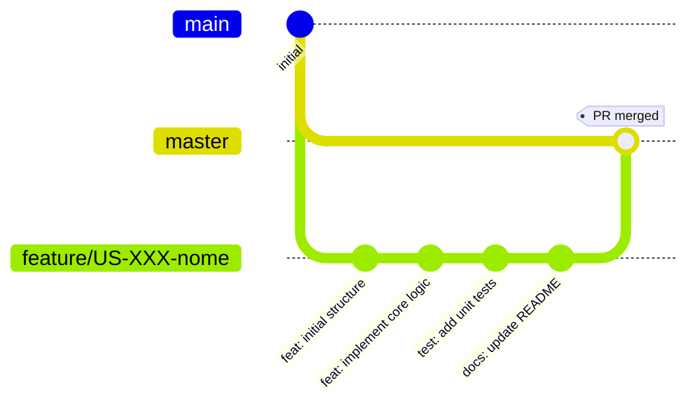

# Contributing to ProfileBot

## Git Workflow

### Branch Naming Convention

Ogni User Story deve avere un **feature branch dedicato** con naming standardizzato:

```
feature/US-XXX-descrizione-breve
```

**Esempi:**
- `feature/US-002-qdrant-setup`
- `feature/US-003-cv-parser`
- `feature/US-004-skill-extraction`

### Branch Types

| Prefix | Uso | Esempio |
|--------|-----|---------|
| `feature/` | Nuove funzionalità (User Stories) | `feature/US-003-cv-parser` |
| `bugfix/` | Fix di bug | `bugfix/123-fix-embedding-error` |
| `hotfix/` | Fix urgenti su master | `hotfix/critical-api-fix` |
| `refactor/` | Refactoring senza nuove feature | `refactor/cleanup-services` |
| `docs/` | Solo documentazione | `docs/update-api-docs` |

### Workflow per User Story



### Step-by-Step

1. **Assegna issue a te stesso**
   ```bash
   gh issue edit <numero> --add-assignee @me
   ```

2. **Aggiorna issue con feature branch**
   - Aggiungi il nome del branch nel campo dedicato dell'issue

3. **Crea feature branch**
   ```bash
   git checkout master
   git pull origin master
   git checkout -b feature/US-XXX-descrizione
   ```

4. **Sviluppa con commit atomici**
   ```bash
   # Conventional commits
   git commit -m "feat(parser): add DOCX text extraction"
   git commit -m "test(parser): add unit tests for CV parsing"
   git commit -m "docs: update API documentation"
   ```

5. **Push e Pull Request**
   ```bash
   git push -u origin feature/US-XXX-descrizione
   gh pr create --title "[US-XXX] Titolo" --body "Closes #<issue-number>"
   ```

6. **Code Review e Merge**
   - Richiedi review da almeno 1 team member
   - Assicurati che CI passi
   - Squash merge su master

---

## Commit Convention

Usiamo [Conventional Commits](https://www.conventionalcommits.org/):

```
<type>(<scope>): <description>

[optional body]

[optional footer]
```

### Types

| Type | Descrizione |
|------|-------------|
| `feat` | Nuova funzionalità |
| `fix` | Bug fix |
| `docs` | Solo documentazione |
| `style` | Formattazione (no code change) |
| `refactor` | Refactoring senza nuove feature |
| `test` | Aggiunta o modifica test |
| `chore` | Build, CI, dependencies |

### Scopes

| Scope | Area |
|-------|------|
| `parser` | CV parsing module |
| `skills` | Skill extraction/normalization |
| `qdrant` | Vector store operations |
| `api` | FastAPI endpoints |
| `llm` | LLM integration |
| `ui` | Frontend components |

**Esempi:**
```bash
feat(parser): add DOCX metadata extraction
fix(qdrant): handle connection timeout
test(skills): add normalization edge cases
docs(api): update OpenAPI schema
```

---

## Definition of Done (DoD)

Una User Story è **DONE** quando:

### Code Quality
- [ ] Codice passa tutti i linter (`make lint-all`)
- [ ] Codice formattato (`make format`)
- [ ] Type hints su tutte le funzioni pubbliche
- [ ] Nessun TODO/FIXME lasciato nel codice

### Testing
- [ ] Unit test con coverage ≥ 80% per nuovo codice
- [ ] Integration test (se applicabile)
- [ ] Test passano in CI

### Documentation
- [ ] Docstring su funzioni/classi pubbliche
- [ ] README aggiornato (se API changes)
- [ ] OpenAPI spec aggiornata (se endpoint nuovo/modificato)

### Review
- [ ] Pull Request approvata da almeno 1 reviewer
- [ ] Tutti i commenti risolti
- [ ] CI verde

### Deployment
- [ ] Merge su master completato
- [ ] Issue chiusa con link al PR

---

## Pull Request Template

```markdown
## Description
[Descrizione delle modifiche]

## Related Issue
Closes #<issue-number>

## Type of Change
- [ ] New feature (US-XXX)
- [ ] Bug fix
- [ ] Refactoring
- [ ] Documentation

## Checklist
- [ ] Tests added/updated
- [ ] Documentation updated
- [ ] Linting passes
- [ ] Ready for review

## Screenshots (if applicable)
[Aggiungi screenshot per UI changes]
```

---

## Code Review Guidelines

### Reviewer Checklist

- [ ] Il codice segue le convenzioni del progetto
- [ ] La logica è corretta e comprensibile
- [ ] I test coprono i casi principali
- [ ] Non ci sono problemi di sicurezza
- [ ] La documentazione è adeguata
- [ ] Performance: nessun N+1 o operazioni costose

### Feedback Costruttivo

- **Suggerimento:** "Considera di..."
- **Domanda:** "Perché hai scelto...?"
- **Blocco:** "Questo deve essere cambiato perché..."
