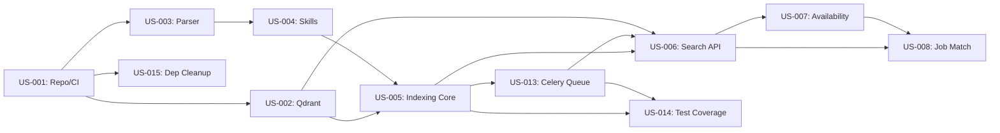

# User Stories - Specifiche Dettagliate

> Questo documento contiene le specifiche tecniche complete per le prime 8 User Stories del MVP ProfileBot.

---

## US-001: Setup Repository e CI/CD

**Epic:** Infrastructure Setup
**Story Points:** 3
**Priority:** P0 - Critical
**Sprint:** 1
**Feature Branch:** `feature/US-001-repo-cicd`

### User Story
**Come** sviluppatore
**Voglio** un repository Git configurato con CI/CD
**Per** poter collaborare e deployare in modo automatizzato

### Acceptance Criteria
- [x] Repository GitHub creato con struttura standard
- [x] Branch protection su `master` (require PR, require CI pass)
- [x] GitHub Actions workflow per lint e test
- [x] Pre-commit hooks configurati (ruff, mypy, bandit)
- [x] Makefile con comandi standard
- [x] pyproject.toml con dipendenze e configurazioni tool

### Technical Details

**Stack:**
- Package Manager: `uv`
- Linting: ruff, mypy, bandit
- Formatting: ruff
- Security: bandit
- Pre-commit: pre-commit framework

**File da creare/modificare:**
```
├── .github/
│   └── workflows/ci.yml
├── .pre-commit-config.yaml
├── pyproject.toml
├── Makefile
└── README.md
```

**CI Pipeline Steps:**
1. Checkout code
2. Setup Python + uv
3. Install dependencies
4. Run linters (ruff, mypy)
5. Run tests (pytest)
6. Security scan (bandit)

### Definition of Done
- [x] CI pipeline verde su ogni commit
- [x] Pre-commit hooks funzionanti
- [x] Documentazione setup nel README
- [x] Branch protection attiva

---

## US-002: Setup Qdrant Vector Store

**Epic:** Infrastructure Setup
**Story Points:** 5
**Priority:** P0 - Critical
**Sprint:** 1
**Feature Branch:** `feature/US-002-qdrant-setup`

### User Story
**Come** data scientist
**Voglio** un'istanza Qdrant configurata
**Per** poter indicizzare e cercare i CV

### Acceptance Criteria
- [ ] Qdrant running via docker-compose
- [ ] Collection `cv_skills` creata con schema corretto
- [ ] Collection `cv_experiences` creata con schema corretto
- [ ] Script di inizializzazione collections
- [ ] Script di test connessione
- [ ] Health check endpoint

### Technical Details

**Stack:**
- Vector Store: Qdrant (latest)
- Client: `qdrant-client` Python SDK
- Container: Docker Compose

**Collection Schema - cv_skills:**
```python
{
    "name": "cv_skills",
    "vectors": {
        "size": 1536,  # OpenAI ada-002
        "distance": "Cosine"
    },
    "payload_schema": {
        "cv_id": "keyword",
        "section_type": "keyword",
        "normalized_skills": "keyword[]",
        "skill_domain": "keyword",
        "seniority_bucket": "keyword",
        "dictionary_version": "keyword",
        "created_at": "datetime"
    }
}
```

**Collection Schema - cv_experiences:**
```python
{
    "name": "cv_experiences",
    "vectors": {
        "size": 1536,
        "distance": "Cosine"
    },
    "payload_schema": {
        "cv_id": "keyword",
        "section_type": "keyword",
        "related_skills": "keyword[]",
        "experience_years": "integer",
        "created_at": "datetime"
    }
}
```

**File da creare:**
```
├── docker-compose.yml (aggiungere Qdrant service)
├── src/services/qdrant/
│   ├── __init__.py
│   ├── client.py          # Singleton client
│   ├── collections.py     # Schema definitions
│   └── health.py          # Health check
├── scripts/
│   └── init_qdrant.py     # Initialize collections
└── tests/
    └── test_qdrant_connection.py
```

**docker-compose.yml snippet:**
```yaml
services:
  qdrant:
    image: qdrant/qdrant:latest
    ports:
      - "6333:6333"
      - "6334:6334"
    volumes:
      - qdrant_data:/qdrant/storage
    environment:
      - QDRANT__SERVICE__GRPC_PORT=6334
```

### Process
1. Aggiungere Qdrant a docker-compose
2. Creare client wrapper con connection pooling
3. Definire schema collections con payload index
4. Creare script di inizializzazione
5. Aggiungere health check a FastAPI
6. Scrivere integration test

### Definition of Done
- [ ] `make docker-up` avvia Qdrant
- [ ] Collections create con schema corretto
- [ ] `/health` endpoint include Qdrant status
- [ ] Test connessione passa in CI
- [ ] README aggiornato con setup Qdrant

---

## US-003: Parser CV DOCX

**Epic:** Document Ingestion
**Story Points:** 8
**Priority:** P0 - Critical
**Sprint:** 1
**Feature Branch:** `feature/US-003-cv-parser`

### User Story
**Come** sistema
**Voglio** estrarre testo strutturato dai CV in formato DOCX
**Per** poter processare i curriculum aziendali

### Acceptance Criteria
- [ ] Parsing sezioni: Skills, Esperienze, Formazione, Certificazioni
- [ ] Estrazione metadata: nome, cognome, ruolo attuale
- [ ] Gestione errori per file malformati o corrotti
- [ ] Supporto encoding UTF-8 e caratteri speciali
- [ ] Unit test con almeno 5 CV di esempio
- [ ] Performance: < 2 sec per CV

### Technical Details

**Stack:**
- DOCX Parsing: `python-docx`
- Text Processing: regex, spacy (optional)
- Validation: pydantic

**Output Schema:**
```python
from pydantic import BaseModel
from typing import Optional
from datetime import date

class CVMetadata(BaseModel):
    cv_id: str
    file_name: str
    full_name: Optional[str]
    current_role: Optional[str]
    parsed_at: datetime

class SkillSection(BaseModel):
    raw_text: str
    skill_keywords: list[str]  # Keywords estratte

class ExperienceItem(BaseModel):
    company: Optional[str]
    role: Optional[str]
    start_date: Optional[date]
    end_date: Optional[date]
    description: str

class ParsedCV(BaseModel):
    metadata: CVMetadata
    skills: SkillSection
    experiences: list[ExperienceItem]
    education: list[str]
    certifications: list[str]
    raw_text: str  # Full text for fallback
```

**File da creare:**
```
├── src/core/parser/
│   ├── __init__.py
│   ├── docx_parser.py     # Main parser
│   ├── section_detector.py # Section identification
│   ├── metadata_extractor.py
│   └── schemas.py         # Pydantic models
├── tests/
│   ├── fixtures/
│   │   └── sample_cvs/    # 5+ sample CVs
│   └── test_cv_parser.py
└── docs/
    └── cv_format_guide.md  # Expected CV format
```

**Section Detection Strategy:**
```python
SECTION_PATTERNS = {
    "skills": [
        r"(?i)^(competenze|skills?|technical skills?|conoscenze)",
        r"(?i)^(tecnologie|tools?|linguaggi)"
    ],
    "experience": [
        r"(?i)^(esperienza|experience|work history|career)",
        r"(?i)^(esperienze professionali|professional)"
    ],
    "education": [
        r"(?i)^(formazione|education|istruzione|studi)"
    ],
    "certifications": [
        r"(?i)^(certificazioni|certifications?|qualifiche)"
    ]
}
```

### Process
1. Leggere DOCX con python-docx
2. Estrarre tutti i paragrafi con stili
3. Identificare sezioni tramite heading/pattern
4. Parsare ogni sezione con logica specifica
5. Estrarre metadata da header/footer
6. Validare con Pydantic
7. Gestire errori con logging dettagliato

### Edge Cases da Gestire
- CV senza sezioni chiare (usare euristica)
- Tabelle con skill
- Immagini (skip con warning)
- File protetti da password
- Encoding non-UTF8

### Definition of Done
- [ ] Parser estrae tutte le sezioni
- [ ] Almeno 5 CV di test diversi
- [ ] Coverage test ≥ 80%
- [ ] Gestione errori documentata
- [ ] Performance validata (< 2 sec/CV)

---

## US-004: Skill Extraction e Normalizzazione

**Epic:** Document Ingestion
**Story Points:** 13
**Priority:** P0 - Critical
**Sprint:** 2
**Feature Branch:** `feature/US-004-skill-extraction`

### User Story
**Come** data scientist
**Voglio** estrarre e normalizzare le skill dai CV
**Per** avere un vocabolario controllato di competenze

### Acceptance Criteria
- [ ] Dizionario skill base con 100+ entry
- [ ] Mapping sinonimi → skill normalizzate
- [ ] Confidence score per ogni mapping (0.0-1.0)
- [ ] Log skill non riconosciute per review
- [ ] Categorizzazione skill per domain
- [ ] Versioning dizionario

### Technical Details

**Stack:**
- Matching: fuzzy matching (`rapidfuzz`), regex
- NLP (optional): spacy per NER
- Storage: YAML/JSON per dizionario

**Skill Dictionary Schema:**
```yaml
# skills_dictionary.yaml
version: "1.0.0"
updated_at: "2025-02-05"

domains:
  - backend
  - frontend
  - data
  - devops
  - management

skills:
  python:
    canonical: "python"
    domain: "backend"
    aliases:
      - "py"
      - "python3"
      - "python 3"
    related:
      - "django"
      - "fastapi"
      - "flask"

  project_management:
    canonical: "project_management"
    domain: "management"
    aliases:
      - "pm"
      - "project manager"
      - "gestione progetti"
    certifications:
      - "PMP"
      - "Prince2"

  # ... 100+ entries
```

**Output Schema:**
```python
class NormalizedSkill(BaseModel):
    original: str           # "Python 3.x"
    canonical: str          # "python"
    domain: str             # "backend"
    confidence: float       # 0.95
    match_type: str         # "exact" | "fuzzy" | "alias"

class SkillExtractionResult(BaseModel):
    cv_id: str
    normalized_skills: list[NormalizedSkill]
    unknown_skills: list[str]  # Per review manuale
    dictionary_version: str
```

**File da creare:**
```
├── src/core/skills/
│   ├── __init__.py
│   ├── extractor.py       # Main extraction logic
│   ├── normalizer.py      # Normalization engine
│   ├── dictionary.py      # Dictionary loader
│   └── schemas.py
├── data/
│   └── skills_dictionary.yaml
├── tests/
│   └── test_skill_extraction.py
└── scripts/
    └── analyze_unknown_skills.py  # Report unknown
```

**Matching Strategy:**
```python
def normalize_skill(raw_skill: str, dictionary: dict) -> NormalizedSkill:
    # 1. Exact match (confidence: 1.0)
    # 2. Alias match (confidence: 0.95)
    # 3. Fuzzy match (confidence: based on ratio)
    # 4. Unknown (logged for review)
```

### Process
1. Caricare dizionario skill (versioned)
2. Per ogni skill raw dal parser:
   - Lowercase e normalizza whitespace
   - Cerca match esatto
   - Cerca tra alias
   - Fuzzy matching con threshold 0.85
   - Se no match → log come unknown
3. Assegnare confidence score
4. Categorizzare per domain
5. Generare report skill sconosciute

### Definition of Done
- [ ] Dizionario con 100+ skill
- [ ] Mapping testato su 50+ skill reali
- [ ] Confidence score coerente
- [ ] Script report unknown skills
- [ ] Unit test per edge cases

---

## US-005: Embedding e Indexing Pipeline

**Epic:** Document Ingestion
**Story Points:** 13
**Priority:** P0 - Critical
**Sprint:** 2
**Feature Branch:** `feature/US-005-embedding-pipeline`

### User Story
**Come** sistema
**Voglio** generare embedding e indicizzare in Qdrant
**Per** abilitare la ricerca semantica

### Acceptance Criteria
- [x] Embedding con OpenAI text-embedding-ada-002 (o alternative)
- [x] Upsert in collection `cv_skills` con payload completo
- [x] Upsert in collection `cv_experiences` con payload completo
- [x] Metadata completi su ogni punto
- [x] Pipeline idempotente (re-run safe)
- [x] Batch processing per performance

### Technical Details

**Stack:**
- Embedding: OpenAI API o `sentence-transformers`
- Vector Store: Qdrant
- Queue: Celery + Redis broker (US-013)

**Embedding Model (decisione MVP):**
```python
# OpenAI (unico per MVP - decisione architetturale)
EMBEDDING_MODEL = "text-embedding-3-small"
EMBEDDING_DIM = 1536

# Nota: sentence-transformers rimandato a future iteration
```

**Pipeline Flow:**
```
ParsedCV
    │
    ├──► Skill Section ──► Embedding ──► cv_skills collection
    │
    └──► Experience Items ──► Embedding (each) ──► cv_experiences collection
```

**Point Schema per cv_skills (allineato a collections.py):**
```python
{
    "id": "cv_001_skills",  # Deterministic ID for idempotency
    "vector": [...],        # 1536 dim
    "payload": {
        "cv_id": "cv_001",
        "section_type": "skills",
        "normalized_skills": ["python", "fastapi", "postgresql"],
        "skill_domain": "backend",
        "seniority_bucket": "senior",
        "dictionary_version": "1.0.0",
        "created_at": "2025-02-05T10:30:00Z"  # Campo esistente in schema
    }
}
```

> **Nota:** Schema adattato a collections.py esistente. `raw_text` NON incluso per MVP.

**File da creare (decisione architetturale approvata):**
```
├── src/core/embedding/          # Core logic unificato
│   ├── __init__.py
│   ├── service.py               # EmbeddingService (OpenAI + tenacity retry)
│   ├── schemas.py               # EmbeddingResult, BatchResult
│   └── pipeline.py              # Orchestrazione CV → embed → upsert
├── scripts/
│   ├── embed_cv.py              # CLI singolo CV
│   └── embed_batch.py           # CLI batch con asyncio
└── tests/
    └── test_embedding_pipeline.py
```

> **Nota:** Entry points in `pyproject.toml` rimandati a US-013 (Celery).
> Gli script usano: `uv run python scripts/embed_cv.py --cv data/cv/sample.docx`

**Idempotency Strategy:**
```python
def generate_point_id(cv_id: str, section: str) -> str:
    """Deterministic ID for upsert idempotency"""
    return f"{cv_id}_{section}"

# Upsert will update if exists, insert if new
qdrant_client.upsert(
    collection_name="cv_skills",
    points=[point],
    wait=True
)
```

### Process
1. Ricevere ParsedCV
2. Estrarre sezione skill → generare embedding
3. Preparare payload con metadata
4. Upsert in cv_skills (idempotent)
5. Per ogni esperienza:
   - Generare embedding
   - Upsert in cv_experiences
6. Log successo/errori

### Performance Considerations
- Batch embedding (max 100 texts per request)
- Async upsert con retry
- Rate limiting per OpenAI API
- Caching embeddings (optional)

### Definition of Done
- [x] Pipeline end-to-end funzionante
- [x] Metadata completi su ogni punto
- [x] Re-run non duplica dati
- [x] Performance: < 5 sec per CV
- [x] Test con 10+ CV reali

---

## US-006: API Ricerca Profili per Skill

**Epic:** Search & Matching
**Story Points:** 8
**Priority:** P1 - High
**Sprint:** 3
**Status:** ✅ Done
**Feature Branch:** `feature/US-006-search-api`
**Dipende da:** US-005 (Embedding Pipeline), US-013 (Celery - per infrastruttura Qdrant popolata)

### User Story
**Come** utente
**Voglio** cercare profili in base a skill richieste
**Per** trovare candidati con competenze specifiche

### Acceptance Criteria
- [x] Endpoint `POST /api/v1/search/skills`
- [x] Input: lista skill, filtri opzionali (seniority, domain, res_ids)
- [x] Output: lista profili ranked con score e `res_id`
- [x] Paginazione risultati (limit, offset)
- [x] Response time < 500ms per query standard
- [x] OpenAPI documentation
- [x] Filtro per `res_id` opzionale (per ricerche mirate)

### Technical Details

**Stack:**
- API: FastAPI
- Validation: Pydantic
- Docs: OpenAPI 3.0

**Request Schema:**
```python
class SkillSearchRequest(BaseModel):
    skills: list[str]                    # ["python", "fastapi"]
    filters: Optional[SearchFilters]
    limit: int = 10
    offset: int = 0

class SearchFilters(BaseModel):
    res_ids: Optional[list[int]]         # 🆕 Filtra per matricole specifiche
    skill_domains: Optional[list[str]]   # ["backend", "data"]
    seniority: Optional[list[str]]       # ["senior", "mid"]
    availability: Optional[str]          # "only_free" | "free_or_partial" | "unavailable" | "any"
```

**Response Schema:**
```python
class ProfileMatch(BaseModel):
    res_id: int                          # 🆕 Matricola risorsa (chiave riconciliazione)
    cv_id: str
    score: float                         # 0.0 - 1.0
    matched_skills: list[str]
    missing_skills: list[str]
    skill_domain: str
    seniority: str

class SkillSearchResponse(BaseModel):
    results: list[ProfileMatch]
    total: int
    limit: int
    offset: int
    query_time_ms: int
```

**File da creare:**
```
├── src/api/
│   ├── __init__.py
│   ├── main.py            # FastAPI app
│   └── v1/
│       ├── __init__.py
│       ├── router.py      # Main router
│       ├── search.py      # Search endpoints
│       └── schemas.py     # Request/response models
├── src/services/search/
│   ├── __init__.py
│   ├── skill_search.py    # Search logic
│   └── scoring.py         # Score calculation
├── src/utils/
│   ├── __init__.py
│   └── normalization.py   # Shared list normalization
└── tests/
    ├── api/
    │   └── test_search_endpoints.py
    ├── test_search_scoring.py
    └── test_skill_search.py
```

**Search Flow:**
```python
async def search_by_skills(request: SkillSearchRequest) -> SkillSearchResponse:
    # 1. Normalizza skill input
    normalized = normalize_string_list(request.skills)

    # 2. Genera embedding query
    query_embedding = embed_skills(normalized)

    # 3. Query Qdrant con filtri
    results = await qdrant.search(
        collection="cv_skills",
        query_vector=query_embedding,
        query_filter=build_filters(request.filters),
        limit=request.limit + request.offset
    )

    # 4. Calcola score e matched skills
    matches = calculate_matches(results, normalized)

    # 5. Pagina e restituisci
    return paginate(matches, request.limit, request.offset)
```

### Process
1. Definire schemas OpenAPI
2. Implementare endpoint FastAPI
3. Integrare con Qdrant search
4. Aggiungere filtering logic
5. Implementare paginazione
6. Scrivere integration test
7. Documentare API

### Definition of Done
- [x] Endpoint funzionante e documentato
- [x] Response < 500ms (testato)
- [x] Paginazione corretta
- [x] Test coverage ≥ 80%
- [x] OpenAPI spec validata
- [x] `res_id` incluso in tutti i response
- [x] Filtro `res_ids` funzionante
- [x] Linting passa (`make lint`)
- [x] PR approvata e CI green

### Commitment
- **Data:** 2026-02-08
- **Issue:** #11
- **Assignee:** Team Development

---

## US-007: Filtro Disponibilità

**Epic:** Search & Matching
**Story Points:** 5
**Priority:** P1 - High
**Sprint:** 3
**Feature Branch:** `feature/US-007-availability-filter`

### User Story
**Come** utente
**Voglio** filtrare i profili per stato di disponibilità
**Per** vedere solo candidati effettivamente assegnabili

### Acceptance Criteria
- [x] Filtri: `only_free`, `free_or_partial`, `any`, `unavailable`
- [x] Input canonico CSV con colonne `res_id,status,allocation_pct,current_project,available_from,available_to,manager_name,updated_at`
- [x] Cache Redis con keyspace `profilebot:availability:{res_id}` e TTL configurabile
- [x] Pre-filtering nel search (se Redis down → fallback `any`)
- [x] Risposta esplicita se nessuno disponibile
- [x] Job asincrono di refresh (Celery + Beat)
- [x] Schedule configurabile via `AVAILABILITY_REFRESH_SCHEDULE`
- [x] Trigger on-demand della task con `csv_path` opzionale

### Technical Details

**Stack:**
- Cache: Redis
- Data Source: CSV canonico (connector esterni in US-016)
- Scheduler: Celery Beat
- Monitoring: Flower

**Availability States:**
```python
from enum import StrEnum

class AvailabilityStatus(StrEnum):
    FREE = "free"
    PARTIAL = "partial"
    BUSY = "busy"
    UNAVAILABLE = "unavailable"
```

**Operational State Schema (canonico):**
```python
class ProfileAvailability(BaseModel):
    res_id: int
    status: AvailabilityStatus
    allocation_pct: int  # 0-100
    current_project: str | None
    available_from: date | None
    available_to: date | None
    manager_name: str | None
    updated_at: datetime
```

**File creati:**
```
├── src/services/availability/
│   ├── __init__.py
│   ├── schemas.py
│   ├── cache.py
│   ├── loader.py
│   ├── service.py
│   └── tasks.py
├── src/api/v1/
│   └── availability.py
├── scripts/
│   └── load_availability.py
├── docs/
│   └── availability_format_guide.md
└── tests/
    ├── test_availability_cache.py
    ├── test_availability_loader.py
    └── test_availability_service.py
```

**Cache Strategy:**
```python
AVAILABILITY_KEY = "profilebot:availability:{res_id}"
AVAILABILITY_TTL = 3600

def get(res_id: int) -> ProfileAvailability | None:
    return cache.get(res_id)

def get_bulk(res_ids: list[int]) -> dict[int, ProfileAvailability]:
    return cache.get_many(res_ids)
```

**Refresh Job (Celery):**
```python
@celery_app.task(bind=True, max_retries=3)
def availability_refresh_task(self, csv_path: str | None = None) -> dict:
    # carica CSV canonico (csv_path override o `AVAILABILITY_REFRESH_CSV_PATH`) e aggiorna Redis
```

### Process
1. Loader CSV canonico → Redis (cache-only)
2. Integrazione search: pre-filter `res_id`
3. Beat schedula refresh periodico
4. Monitoring task via Flower

### Definition of Done
- [x] Filtri funzionanti su tutti i modi
- [x] Cache Redis operativa (TTL configurabile)
- [x] Refresh automatico configurato (Celery Beat)
- [x] Messaggio esplicito se 0 risultati
- [x] Test con dati mock e coverage ≥ 80%

---

## US-008: Match con Job Description

**Epic:** Search & Matching
**Story Points:** 13
**Priority:** P1 - High
**Sprint:** 4
**Feature Branch:** `feature/US-008-job-match`

### User Story
**Come** utente
**Voglio** trovare il miglior profilo per una job description
**Per** proporre candidati ad opportunità specifiche

### Acceptance Criteria
- [ ] Endpoint `POST /api/v1/match/job`
- [ ] Input: testo job description (free text)
- [ ] Estrazione automatica skill richieste dalla JD
- [ ] Ranking profili con spiegazione LLM
- [ ] Output strutturato con motivazione per ogni match
- [ ] Distinzione tra must-have e nice-to-have skills

### Technical Details

**Stack:**
- LLM: OpenAI GPT-4 / Azure OpenAI
- Extraction: LLM-based skill extraction
- Ranking: Vector similarity + LLM reasoning

**Request Schema:**
```python
class JobMatchRequest(BaseModel):
    job_description: str              # Free text JD
    max_candidates: int = 5
    availability_filter: str = "free_or_partial"
    include_explanation: bool = True
```

**Response Schema:**
```python
class SkillRequirement(BaseModel):
    skill: str
    importance: str  # "must_have" | "nice_to_have"

class CandidateMatch(BaseModel):
    cv_id: str
    overall_score: float
    matched_skills: list[str]
    missing_skills: list[str]
    explanation: str  # LLM-generated
    strengths: list[str]
    gaps: list[str]

class JobMatchResponse(BaseModel):
    extracted_requirements: list[SkillRequirement]
    candidates: list[CandidateMatch]
    no_match_reason: Optional[str]  # If 0 candidates
```

**File da creare:**
```
├── src/api/v1/
│   └── job_match.py       # Endpoint
├── src/services/matching/
│   ├── __init__.py
│   ├── job_analyzer.py    # JD skill extraction
│   ├── candidate_ranker.py # Ranking logic
│   └── explainer.py       # LLM explanations
├── src/core/llm/
│   ├── __init__.py
│   ├── client.py          # LLM client wrapper
│   └── prompts.py         # System/user prompts
└── tests/
    └── test_job_matching.py
```

**JD Skill Extraction Prompt:**
```python
JD_EXTRACTION_PROMPT = """
Analizza la seguente job description ed estrai le skill richieste.

Job Description:
{job_description}

Restituisci un JSON con:
{{
    "must_have": ["skill1", "skill2"],
    "nice_to_have": ["skill3", "skill4"],
    "seniority": "junior|mid|senior",
    "domain": "backend|frontend|data|devops|management"
}}

Usa solo skill dal vocabolario standard. Non inventare skill.
"""
```

**Matching Flow:**
```
Job Description
      │
      ▼
┌─────────────────┐
│ LLM Extraction  │ ──► Required Skills + Filters
└─────────────────┘
      │
      ▼
┌─────────────────┐
│ Vector Search   │ ──► Candidate Shortlist (K=20)
└─────────────────┘
      │
      ▼
┌─────────────────┐
│ Availability    │ ──► Filtered Candidates
│ Filter          │
└─────────────────┘
      │
      ▼
┌─────────────────┐
│ LLM Ranking     │ ──► Top N with Explanations
└─────────────────┘
```

**LLM Decision Prompt:**
```python
RANKING_PROMPT = """
Sei un assistente per il matching professionale.
La selezione deve basarsi PRINCIPALMENTE sulle skill.
Le esperienze servono solo come supporto.

Job Requirements:
{requirements}

Candidate Profiles:
{profiles}

Per ogni candidato fornisci:
1. Score (0-100)
2. Skill matchate
3. Skill mancanti
4. Breve motivazione (2-3 frasi)

Output JSON:
{{
    "rankings": [
        {{
            "cv_id": "...",
            "score": 85,
            "matched": ["python", "fastapi"],
            "missing": ["kubernetes"],
            "explanation": "..."
        }}
    ]
}}
"""
```

### Process
1. Ricevere JD text
2. Estrarre skill con LLM (must-have/nice-to-have)
3. Normalizzare skill estratte
4. Vector search su cv_skills
5. Applicare filtro disponibilità
6. Recuperare esperienze per shortlist
7. LLM ranking con spiegazioni
8. Formattare response

### LLM Parameters
- Model: GPT-4 / GPT-4-turbo
- Temperature: 0.1 (deterministic)
- Max tokens: 2000
- Response format: JSON mode

### Definition of Done
- [ ] Endpoint funzionante end-to-end
- [ ] Estrazione skill accurata (test su 5 JD)
- [ ] Spiegazioni coerenti e utili
- [ ] Response time < 10 sec
- [ ] Test con JD reali

---

## US-013: Celery Job Queue e API Endpoints

**Epic:** Document Ingestion (scalabilità)
**Story Points:** 8
**Priority:** P0 - Critical
**Sprint:** 2/3
**Feature Branch:** `feature/US-013-celery-job-queue`
**Dipende da:** US-005 (Embedding Pipeline Core)

### User Story
**Come** sistema ProfileBot
**Voglio** una job queue scalabile per processare embedding di CV in modo asincrono
**In modo da** gestire 10.000+ CV con richieste multiple al giorno senza bloccare l'API

### Requisiti di Volume

| Parametro | Valore |
|-----------|--------|
| Volume CV | **10.000+** |
| Frequenza | **Multiple volte/giorno** |
| Modalità | **On-demand + Batch schedulato** |
| Throughput target | ~5.000 CV/minuto (con 4 worker) |
| Ambiente | **Celery + Flower in PRODUZIONE** |

---

### ⚠️ ARCHITETTURA CRITICA: `res_id` come Chiave di Riconciliazione

> **Decisione Business:** Ogni CV e **ogni altra fonte dati futura** fa riferimento a un `res_id`
> (dato numerico che rappresenta la **matricola** della risorsa). Tutte le fonti dati saranno
> riconciliate tramite questo identificativo.

**Impatti architetturali:**

1. **`res_id` è REQUIRED** - Ogni CV deve avere un `res_id` associato
2. **`cv_id` rimane per identificare il documento** - Ma `res_id` è la chiave di join
3. **Qdrant payload aggiornato** - Tutti i punti devono includere `res_id`
4. **Future fonti dati** - Certificazioni, corsi, valutazioni useranno lo stesso `res_id`

**Schema Payload Aggiornato (cv_skills):**
```python
{
    "id": "cv_001_skills",
    "vector": [...],
    "payload": {
        "res_id": 12345,              # 🆕 REQUIRED - Matricola risorsa
        "cv_id": "cv_001",            # ID documento CV
        "section_type": "skills",
        "normalized_skills": ["python", "fastapi"],
        "skill_domain": "backend",
        "seniority_bucket": "unknown",
        "dictionary_version": "1.0.0",
        "created_at": "2025-02-05T10:30:00Z"
    }
}
```

**Schema Payload Aggiornato (cv_experiences):**
```python
{
    "id": "cv_001_exp_0",
    "vector": [...],
    "payload": {
        "res_id": 12345,              # 🆕 REQUIRED - Matricola risorsa
        "cv_id": "cv_001",
        "section_type": "experience",
        "related_skills": ["python", "fastapi"],
        "experience_years": 2,
        "created_at": "2025-02-05T10:30:00Z"
    }
}
```

---

### Acceptance Criteria
- [x] Redis broker configurato e funzionante
- [x] Celery worker con task per singolo CV e batch
- [x] API endpoint `POST /api/v1/embeddings/trigger` per avvio job batch
- [x] API endpoint `POST /api/v1/embeddings/trigger/{res_id}` per singola risorsa
- [x] API endpoint `GET /api/v1/embeddings/status/{task_id}` per polling stato
- [x] Celery Beat per scheduling periodico
- [x] Docker compose con worker scalabili (replicas)
- [x] Flower dashboard per monitoring (porta 5555) - **PRODUZIONE**
- [x] Retry automatico con exponential backoff su rate limit
- [x] `res_id` incluso in tutti i payload Qdrant
- [ ] Test coverage ≥ 80% *(tracked in US-014)*
- [x] Documentazione API (OpenAPI)

### Technical Details

**Stack:**
- Broker: Redis (anche per result backend)
- Job Queue: Celery
- Scheduler: Celery Beat
- Monitoring: Flower (**produzione**)
- API: FastAPI

**Architettura Multi-Source con `res_id`:**
```
                    ┌─────────────────────────────────┐
                    │           Data Sources          │
                    │  ┌─────┐ ┌─────┐ ┌──────────┐  │
                    │  │ CV  │ │Cert │ │ Training │  │
                    │  │DOCX │ │ DB  │ │   API    │  │
                    │  └──┬──┘ └──┬──┘ └────┬─────┘  │
                    │     │      │         │        │
                    │     └──────┼─────────┘        │
                    │            │                  │
                    │      ┌─────▼─────┐            │
                    │      │  res_id   │ ◄── Chiave │
                    │      │ (matricola)│    Riconciliazione
                    │      └─────┬─────┘            │
                    └────────────┼──────────────────┘
                                 │
┌────────────────────────────────▼────────────────────────────────┐
│                         FastAPI                                  │
│  POST /api/v1/embeddings/trigger           (batch schedulato)   │
│  POST /api/v1/embeddings/trigger/{res_id}  (on-demand)          │
│  GET  /api/v1/embeddings/status/{task_id}  (polling)            │
│  GET  /api/v1/embeddings/stats             (statistiche)        │
└─────────────────────┬───────────────────────────────────────────┘
                      │
                      ▼
┌─────────────────────────────────────────────────────────────────┐
│                    Redis (Broker + Result Backend)               │
└─────────────────────┬───────────────────────────────────────────┘
                      │
        ┌─────────────┼─────────────┬─────────────┐
        ▼             ▼             ▼             ▼
┌─────────────┐ ┌─────────────┐ ┌─────────────┐ ┌─────────────┐
│  Worker 1   │ │  Worker 2   │ │  Worker N   │ │ Celery Beat │
│  (-c 4)     │ │  (-c 4)     │ │  (-c 4)     │ │ (scheduler) │
└──────┬──────┘ └──────┬──────┘ └──────┬──────┘ └─────────────┘
       │               │               │
       └───────────────┼───────────────┘
                       ▼
              ┌─────────────────┐
              │  US-005 Core    │
              │  EmbeddingPipeline.process_cv()  │
              └────────┬────────┘
                       ▼
              ┌─────────────────┐
              │     Qdrant      │
              │  (res_id + cv_id in payload)    │
              └─────────────────┘
```

**File da creare/modificare:**
```
├── src/services/embedding/
│   ├── celery_app.py      # Celery app configuration
│   ├── celery_config.py   # Celery settings (broker, backend, task routes)
│   ├── tasks.py           # Celery tasks (embed_cv, embed_batch, embed_all)
│   └── worker.py          # Worker entry point (opzionale, docker usa celery CLI)
├── src/api/v1/
│   └── embeddings.py      # API endpoints trigger/status
├── src/core/parser/
│   └── schemas.py         # 🔄 MODIFICARE: aggiungere res_id a CVMetadata
├── src/core/embedding/
│   └── pipeline.py        # 🔄 MODIFICARE: passare res_id al payload Qdrant
├── src/services/qdrant/
│   └── collections.py     # 🔄 MODIFICARE: aggiungere res_id a payload index
└── tests/
    ├── test_celery_tasks.py
    └── test_embedding_pipeline.py  # 🔄 MODIFICARE: aggiungere test res_id
```

**Modifica CVMetadata (src/core/parser/schemas.py):**
```python
class CVMetadata(BaseModel):
    """Metadata extracted from the CV header or file context."""

    res_id: int = Field(..., description="Matricola risorsa (chiave riconciliazione)")
    cv_id: str = Field(..., description="Unique CV identifier")
    file_name: str = Field(..., description="Original file name")
    full_name: str | None = Field(None, description="Candidate full name")
    current_role: str | None = Field(None, description="Current role or title")
    parsed_at: datetime = Field(default_factory=datetime.utcnow)
```

**Celery Tasks:**
```python
@celery_app.task(bind=True, max_retries=3, default_retry_delay=60)
def embed_cv_task(self, res_id: int, cv_path: str) -> dict:
    """
    Embed singolo CV per res_id.

    Args:
        res_id: Matricola risorsa (chiave riconciliazione)
        cv_path: Path al file CV da processare

    Returns:
        dict con cv_skills, cv_experiences, total counts
    """
    try:
        parsed_cv = parse_cv(cv_path, res_id=res_id)
        skill_result = extract_skills(parsed_cv)
        return EmbeddingPipeline().process_cv(parsed_cv, skill_result)
    except RateLimitError as exc:
        raise self.retry(exc=exc, countdown=60 * (self.request.retries + 1))

@celery_app.task
def embed_batch_task(items: list[dict]) -> dict:
    """
    Batch di CV - parallelizza tramite group().

    Args:
        items: Lista di {"res_id": int, "cv_path": str}

    Returns:
        dict con totali aggregati
    """
    from celery import group
    job = group(embed_cv_task.s(item["res_id"], item["cv_path"]) for item in items)
    return job.apply_async()

@celery_app.task
def embed_all_task(force: bool = False) -> dict:
    """
    Full re-embed di tutti i CV (scheduled via Beat).

    Args:
        force: Se True, re-embed anche se già indicizzato
    """
    # Recupera lista CV da directory o database
    # Lancia embed_batch_task con chunking
```

**API Endpoints:**
```python
POST /api/v1/embeddings/trigger              # Avvia full embedding (batch)
POST /api/v1/embeddings/trigger/{res_id}     # Embedding singola risorsa
GET  /api/v1/embeddings/status/{task_id}     # Stato task (polling)
GET  /api/v1/embeddings/stats                # Statistiche queue
DELETE /api/v1/embeddings/{res_id}           # Rimuovi embeddings risorsa
```

**Celery Beat Schedule (src/services/embedding/celery_config.py):**
```python
from celery.schedules import crontab

CELERY_BEAT_SCHEDULE = {
    "daily-full-reindex": {
        "task": "src.services.embedding.tasks.embed_all_task",
        "schedule": crontab(hour=2, minute=0),  # Ogni notte alle 02:00
        "args": (False,),  # force=False
    },
}
```

**Docker Compose (già presente, verificato):**
```yaml
services:
  redis:
    image: redis:7-alpine
    container_name: profilebot-redis
    ports:
      - "6379:6379"
    volumes:
      - redis_data:/data
    restart: unless-stopped

  celery-worker:
    build: .
    container_name: profilebot-celery-worker
    command: celery -A src.services.embedding.celery_app worker -l info -c 4
    environment:
      - REDIS_URL=redis://redis:6379/0
      - CELERY_BROKER_URL=redis://redis:6379/0
      - CELERY_RESULT_BACKEND=redis://redis:6379/0
      - QDRANT_URL=http://qdrant:6333
      - OPENAI_API_KEY=${OPENAI_API_KEY}
    depends_on:
      - redis
      - qdrant
    restart: unless-stopped

  celery-beat:
    build: .
    container_name: profilebot-celery-beat
    command: celery -A src.services.embedding.celery_app beat -l info
    environment:
      - REDIS_URL=redis://redis:6379/0
      - CELERY_BROKER_URL=redis://redis:6379/0
      - CELERY_RESULT_BACKEND=redis://redis:6379/0
    depends_on:
      - redis
      - celery-worker
    restart: unless-stopped

  flower:
    build: .
    container_name: profilebot-flower
    command: celery -A src.services.embedding.celery_app flower --port=5555
    ports:
      - "5555:5555"
    environment:
      - REDIS_URL=redis://redis:6379/0
      - CELERY_BROKER_URL=redis://redis:6379/0
      - CELERY_RESULT_BACKEND=redis://redis:6379/0
    depends_on:
      - redis
      - celery-worker
    restart: unless-stopped
```

### Process
1. **Modificare schema CVMetadata** - Aggiungere `res_id: int` come campo required
2. **Modificare EmbeddingPipeline** - Passare `res_id` ai payload Qdrant
3. **Aggiornare collections.py** - Aggiungere `res_id` al payload index
4. Configurare Redis come Celery broker e result backend
5. Implementare `celery_app.py` con configurazione production-ready
6. Creare task per embed singolo, batch, e full con retry
7. Configurare Celery Beat per scheduling notturno
8. Implementare API endpoints FastAPI
9. Verificare docker-compose (già presente)
10. Aggiungere Makefile targets (worker, flower, beat)
11. Scrivere test unitari e integration
12. Aggiornare test esistenti con `res_id`

### Definition of Done
- [x] `res_id` aggiunto a `CVMetadata` (BREAKING CHANGE)
- [x] `res_id` incluso in tutti i payload Qdrant
- [x] `celery_app.py` con configurazione production-ready
- [x] `celery_config.py` con Beat schedule
- [x] `tasks.py` con task per embed singolo, batch, e full
- [x] `embeddings.py` API router con tutti gli endpoint
- [x] `docker-compose.yml` verificato (già presente)
- [x] Test unitari e integration per tasks
- [x] Test aggiornati con `res_id`
- [x] Makefile target: `make worker`, `make flower`, `make beat`
- [x] README aggiornato con istruzioni worker
- [x] Linting passa (`make lint`)
- [x] PR approvata e CI green

### Estimate
**3 giorni** (include modifiche schema e test)

---

### Decisioni Architetturali - Q&A Team

#### 1. Fonte Dati e Input

**Q: Da dove il sistema recupera i CV? Directory locale, API, database?**
> **A:** Per MVP, directory locale configurabile (`CV_DIRECTORY` in `.env`).
> Future iterazioni: API endpoint per upload, integrazione SharePoint.

**Q: Chi fornisce il mapping `res_id` → `cv_path`? File CSV, database, naming convention?**
> **A:** Per MVP, **naming convention**: il file CV deve contenere `res_id` nel nome.
> Formato: `{res_id}_{nome}_{cognome}.docx` (es. `12345_mario_rossi.docx`)
> Il parser estrae `res_id` dal filename.

**Q: Esiste già un database anagrafico risorse da interrogare?**
> **A:** No per MVP. Il `res_id` viene estratto dal filename.
> Future iterazioni: integrazione con HR database.

#### 2. Re-embed e Consistenza Dati

**Q: Se un CV viene aggiornato, il task deve rilevare la modifica?**
> **A:** Per MVP, **force mode** disponibile. Default: skip se `created_at` recente.
> Logica: confronto timestamp file vs `created_at` in Qdrant.

**Q: Prima di re-embed, vanno eliminati i punti esistenti per quel `res_id`?**
> **A:** **Sì, delete-then-insert** per garantire consistenza.
> Il punto ID deterministico garantisce upsert, ma le esperienze potrebbero cambiare numero.

**Q: Come gestiamo la consistenza durante re-index massivo?**
> **A:** Scheduling notturno (02:00) per evitare conflitti.
> Lock distribuito via Redis per prevenire job concorrenti sullo stesso `res_id`.

#### 3. Performance e Limiti

**Q: Quale chunk size per batch embedding?**
> **A:** `EMBEDDING_BATCH_SIZE=100` (già in US-005). Configurabile via env.

**Q: Quanti worker paralleli in produzione?**
> **A:** `-c 4` per worker (4 thread). Scalabile con `replicas` in docker-compose.
> Target: 2-4 worker = 8-16 thread paralleli.

**Q: Rate limiting OpenAI come viene gestito?**
> **A:** Retry con exponential backoff via `tenacity` (già in US-005).
> Task Celery: `max_retries=3`, `default_retry_delay=60`.

#### 4. API e UX

**Q: L'endpoint `/trigger/{res_id}` accetta solo `res_id` o anche path CV opzionale?**
> **A:** Accetta `res_id`. Il path viene risolto internamente da naming convention.
> Optional body: `{"cv_path": "/custom/path.docx"}` per override.

**Q: Il response di `/trigger` è sincrono (task_id) o attende completamento?**
> **A:** **Asincrono** - ritorna immediatamente `task_id` per polling.

**Q: `/status/{task_id}` mostra progresso parziale o solo PENDING/SUCCESS/FAILURE?**
> **A:** MVP: solo stati Celery (PENDING, STARTED, SUCCESS, FAILURE).
> Future: progress percentage via Redis pub/sub.

#### 5. Scheduling e Operazioni

**Q: Celery Beat gira nello stesso container del worker o separato?**
> **A:** **Container separato** (`celery-beat`). Già configurato in docker-compose.

**Q: Come viene triggerato il job schedulato? Cron interno o Beat schedule?**
> **A:** **Celery Beat** con schedule in `celery_config.py`.

**Q: Flower è esposto pubblicamente o solo rete interna?**
> **A:** MVP: esposto su porta 5555 per monitoring.
> Produzione: behind reverse proxy con auth.

#### 6. Domande Aperte (per Product Owner)

**Q: Se il CV non contiene `res_id` nel filename, il job deve fallire o loggare warning?**
> **A:** ⚠️ **DA DEFINIRE** - Proposta: fail con error specifico.

**Q: Quale TTL per i risultati task in Redis?**
> **A:** ⚠️ **DA DEFINIRE** - Proposta: 24 ore (`result_expires=86400`).

**Q: Il full re-index notturno deve notificare completamento (email, webhook)?**
> **A:** ⚠️ **DA DEFINIRE** - Proposta: log + Flower alert per MVP.

---

## US-014: Test Coverage Improvement (Technical Debt)

**Epic:** Quality Assurance
**Story Points:** 5
**Priority:** P1 - High
**Sprint:** 3
**Feature Branch:** `feature/US-014-test-coverage`
**Dipende da:** US-005, US-013

### User Story
**Come** team di sviluppo
**Voglio** test coverage completa per parser, embedding pipeline e Celery tasks
**Per** garantire stabilità e regressione zero nelle future iterazioni

### Contesto

Dalla review dei test esistenti (US-005/US-013) sono emersi gap di copertura che devono essere colmati per raggiungere il target di **≥80% coverage**.

#### Test Esistenti (Analisi)

| File | Lines | Coverage | Status |
|------|-------|----------|--------|
| `test_cv_parser.py` | 138 | ⭐⭐⭐⭐ | Buona copertura `res_id` |
| `test_embedding_pipeline.py` | 228 | ⭐⭐⭐⭐ | Payload, dry_run, dedup |
| `test_celery_tasks.py` | 88 | ⭐⭐⭐ | Base coverage |
| `test_skill_extraction.py` | 161 | ⭐⭐⭐⭐ | Completo |

---

### Acceptance Criteria

- [ ] Test `embed_batch_task` con multiple items
- [ ] Test `embed_all_task` con directory scan
- [ ] Test retry behavior su rate limit OpenAI
- [ ] Test `res_id` mismatch tra filename e request
- [ ] Test Qdrant collection schema con `res_id` index
- [ ] Test con CV anonimi (100000-100009)
- [ ] Test leading zeros in `res_id`
- [ ] Coverage ≥ 80% su tutti i moduli core
- [ ] CI green con tutti i nuovi test

---

### Technical Details

#### 1. Test Mancanti - `test_cv_parser.py`

**File:** `tests/test_cv_parser.py`

```python
# === TEST DA AGGIUNGERE ===

def test_parse_docx__leading_zeros__strips_to_int(tmp_path: Path) -> None:
    """
    Leading zeros nel res_id devono essere convertiti a int.

    Input: "00123_mario_rossi.docx"
    Expected: res_id = 123 (int), NOT "00123" (string)
    """
    docx_path = tmp_path / "00123_mario_rossi.docx"
    document = Document()
    document.add_paragraph("Test CV")
    document.save(docx_path)

    parsed = parse_docx(docx_path)

    assert parsed.metadata.res_id == 123
    assert isinstance(parsed.metadata.res_id, int)


def test_parse_docx__very_large_res_id__handles_correctly(tmp_path: Path) -> None:
    """
    res_id molto grandi devono essere gestiti senza overflow.

    Input: "999999999_mario_rossi.docx"
    Expected: res_id = 999999999
    """
    docx_path = tmp_path / "999999999_mario_rossi.docx"
    document = Document()
    document.add_paragraph("Test CV")
    document.save(docx_path)

    parsed = parse_docx(docx_path)

    assert parsed.metadata.res_id == 999999999


@pytest.mark.parametrize("res_id", [100000, 100001, 100002, 100003, 100004,
                                     100005, 100006, 100007, 100008, 100009])
def test_parse_anonymous_cvs__extracts_correct_res_id(res_id: int) -> None:
    """
    Test parsing su tutti i CV anonimi generati.

    Verifica:
    - res_id estratto correttamente
    - Struttura CV valida (skills, experiences)
    - No eccezioni
    """
    import glob
    pattern = str(FIXTURES_DIR / f"{res_id}_*.docx")
    matches = glob.glob(pattern)
    assert len(matches) == 1, f"Expected 1 CV for res_id {res_id}"

    parsed = parse_docx(Path(matches[0]))

    assert parsed.metadata.res_id == res_id
    assert parsed.skills is not None or parsed.raw_text
    assert isinstance(parsed.experiences, list)


def test_parse_docx__special_characters_in_name__parses_correctly(tmp_path: Path) -> None:
    """
    Nomi con caratteri speciali devono essere gestiti.

    Input: "12345_giuseppe_d'amico.docx"
    Expected: parse senza errori
    """
    docx_path = tmp_path / "12345_giuseppe_d'amico.docx"
    document = Document()
    document.add_paragraph("Test CV")
    document.save(docx_path)

    parsed = parse_docx(docx_path)

    assert parsed.metadata.res_id == 12345
```

---

#### 2. Test Mancanti - `test_embedding_pipeline.py`

**File:** `tests/test_embedding_pipeline.py`

```python
# === TEST DA AGGIUNGERE ===

def test_process_cv__experiences_payload__includes_related_skills(monkeypatch):
    """
    Payload experiences deve includere related_skills dal skill_result.

    Verifica che le skill estratte siano propagate agli experience payload.
    """
    parsed_cv = _make_parsed_cv()
    skill_result = _make_skill_result()
    embedding_service = DummyEmbeddingService()
    qdrant_client = MagicMock()

    pipeline = EmbeddingPipeline(
        embedding_service=embedding_service,
        qdrant_client=qdrant_client,
    )

    pipeline.process_cv(parsed_cv, skill_result, dry_run=False)

    cv_exp_call = qdrant_client.upsert.call_args_list[1]
    cv_exp_points = cv_exp_call.kwargs["points"]

    for point in cv_exp_points:
        assert "related_skills" in point.payload
        assert isinstance(point.payload["related_skills"], list)


def test_process_cv__no_experiences__skips_cv_experiences_upsert(monkeypatch):
    """
    Se il CV non ha esperienze, non deve fare upsert su cv_experiences.
    """
    metadata = CVMetadata(cv_id="cv-no-exp", res_id=99999, file_name="cv.docx")
    skills = SkillSection(raw_text="Python", skill_keywords=["Python"])
    parsed_cv = ParsedCV(
        metadata=metadata,
        skills=skills,
        experiences=[],  # Nessuna esperienza
        education=[],
        certifications=[],
        raw_text="",
    )
    skill_result = _make_skill_result()
    embedding_service = DummyEmbeddingService()
    qdrant_client = MagicMock()

    pipeline = EmbeddingPipeline(
        embedding_service=embedding_service,
        qdrant_client=qdrant_client,
    )

    result = pipeline.process_cv(parsed_cv, skill_result, dry_run=False)

    assert result["cv_experiences"] == 0
    # Solo 1 upsert (skills), no experiences
    assert qdrant_client.upsert.call_count == 1


def test_process_cv__deterministic_point_ids__enables_idempotency(monkeypatch):
    """
    Point IDs devono essere deterministici per garantire idempotency.

    Format atteso:
    - Skills: "{cv_id}_skills"
    - Experiences: "{cv_id}_exp_{index}"
    """
    parsed_cv = _make_parsed_cv()
    skill_result = _make_skill_result()
    embedding_service = DummyEmbeddingService()
    qdrant_client = MagicMock()

    pipeline = EmbeddingPipeline(
        embedding_service=embedding_service,
        qdrant_client=qdrant_client,
    )

    pipeline.process_cv(parsed_cv, skill_result, dry_run=False)

    cv_skills_points = qdrant_client.upsert.call_args_list[0].kwargs["points"]
    assert cv_skills_points[0].id == "cv-123_skills"

    cv_exp_points = qdrant_client.upsert.call_args_list[1].kwargs["points"]
    assert cv_exp_points[0].id == "cv-123_exp_0"
    assert cv_exp_points[1].id == "cv-123_exp_1"
```

---

#### 3. Test Mancanti - `test_celery_tasks.py` (PRIORITÀ ALTA)

**File:** `tests/test_celery_tasks.py`

```python
# === TEST DA AGGIUNGERE ===

def test_embed_batch_task__multiple_items__spawns_subtasks(
    monkeypatch: pytest.MonkeyPatch,
) -> None:
    """
    embed_batch_task deve creare un gruppo di subtask per ogni item.

    Input: [{"res_id": 100, "cv_path": "..."}, {"res_id": 101, "cv_path": "..."}]
    Expected: group() con 2 embed_cv_task.s()
    """
    from unittest.mock import MagicMock, patch

    items = [
        {"res_id": 100, "cv_path": "/path/100_a_b.docx"},
        {"res_id": 101, "cv_path": "/path/101_c_d.docx"},
        {"res_id": 102, "cv_path": "/path/102_e_f.docx"},
    ]

    mock_group = MagicMock()
    mock_group.return_value.apply_async.return_value = MagicMock(id="group-task-id")

    with patch("src.services.embedding.tasks.group", mock_group):
        result = tasks.embed_batch_task(items)

    # Verifica che group sia stato chiamato con 3 signature
    assert mock_group.called
    signatures = mock_group.call_args[0][0]
    assert len(list(signatures)) == 3


def test_embed_all_task__scans_cv_directory__queues_batch(
    monkeypatch: pytest.MonkeyPatch,
    tmp_path: Path,
) -> None:
    """
    embed_all_task deve:
    1. Scansionare CV_DIRECTORY
    2. Filtrare file con pattern {res_id}_*.docx
    3. Lanciare embed_batch_task
    """
    # Setup: crea CV fittizi
    (tmp_path / "100_a_b.docx").write_bytes(b"dummy")
    (tmp_path / "101_c_d.docx").write_bytes(b"dummy")
    (tmp_path / "invalid.docx").write_bytes(b"dummy")  # No res_id prefix

    monkeypatch.setenv("CV_DIRECTORY", str(tmp_path))

    batch_calls = []
    def mock_batch_task(items):
        batch_calls.append(items)
        return {"queued": len(items)}

    monkeypatch.setattr(tasks, "embed_batch_task", MagicMock(side_effect=mock_batch_task))

    result = tasks.embed_all_task.run(force=False)

    # Solo 2 CV validi (100, 101), non invalid.docx
    assert len(batch_calls) == 1
    assert len(batch_calls[0]) == 2


def test_embed_cv_task__rate_limit_error__retries_with_backoff(
    monkeypatch: pytest.MonkeyPatch,
    tmp_path: Path,
) -> None:
    """
    Rate limit OpenAI deve triggerare retry con exponential backoff.

    Retry: countdown = 60 * (retries + 1)
    - 1st retry: 60s
    - 2nd retry: 120s
    - 3rd retry: 180s
    """
    from openai import RateLimitError

    cv_path = tmp_path / "12345_mario_rossi.docx"
    cv_path.write_bytes(b"dummy")

    retry_calls = []

    def mock_retry(*, exc, countdown):
        retry_calls.append({"exc": exc, "countdown": countdown})
        raise exc  # Re-raise per simulare failure finale

    def mock_embed_cv(*args, **kwargs):
        raise RateLimitError("Rate limit exceeded", response=None, body=None)

    monkeypatch.setattr(tasks.embed_cv_task, "retry", mock_retry)
    monkeypatch.setattr(tasks, "_embed_cv", mock_embed_cv)

    with pytest.raises(RateLimitError):
        tasks.embed_cv_task.run(cv_path=str(cv_path), res_id="12345")

    assert len(retry_calls) == 1
    assert retry_calls[0]["countdown"] == 60  # First retry


def test_embed_cv_task__res_id_mismatch__logs_warning(
    monkeypatch: pytest.MonkeyPatch,
    tmp_path: Path,
    caplog,
) -> None:
    """
    Se res_id nel filename != res_id richiesto, logga warning.

    Input: filename "12345_...", request res_id="99999"
    Expected: WARNING log, ma usa res_id del filename (12345)
    """
    import logging
    caplog.set_level(logging.WARNING)

    cv_path = tmp_path / "12345_mario_rossi.docx"
    cv_path.write_bytes(b"dummy")

    tasks.embed_cv_task.request.id = "task-mismatch"
    states = []

    def _update_state(*, state, meta):
        states.append({"state": state, "meta": meta})

    def _embed_cv(*args, **kwargs):
        return "cv-123", 12345, {"cv_skills": 1, "cv_experiences": 0, "total": 1}

    monkeypatch.setattr(tasks.embed_cv_task, "update_state", _update_state)
    monkeypatch.setattr(tasks, "_embed_cv", _embed_cv)

    # Request con res_id diverso dal filename
    result = tasks.embed_cv_task.run(cv_path=str(cv_path), res_id="99999")

    # Il risultato usa res_id del filename
    assert result["res_id"] == 12345

    # Warning loggato
    assert "mismatch" in caplog.text.lower() or "99999" in caplog.text


def test_embed_cv_task__success__returns_complete_result(
    monkeypatch: pytest.MonkeyPatch,
    tmp_path: Path,
) -> None:
    """
    Task completato con successo deve restituire risultato completo.

    Expected result keys: res_id, cv_id, cv_skills, cv_experiences, total
    """
    cv_path = tmp_path / "12345_mario_rossi.docx"
    cv_path.write_bytes(b"dummy")

    tasks.embed_cv_task.request.id = "task-success"

    def _update_state(*, state, meta):
        pass

    def _embed_cv(*args, **kwargs):
        return "cv-123", 12345, {"cv_skills": 1, "cv_experiences": 3, "total": 4}

    monkeypatch.setattr(tasks.embed_cv_task, "update_state", _update_state)
    monkeypatch.setattr(tasks, "_embed_cv", _embed_cv)

    result = tasks.embed_cv_task.run(cv_path=str(cv_path), res_id="12345")

    assert result["res_id"] == 12345
    assert result["cv_id"] == "cv-123"
    assert result["cv_skills"] == 1
    assert result["cv_experiences"] == 3
    assert result["total"] == 4
```

---

#### 4. Test Mancanti - `test_qdrant_collections.py` (NUOVO FILE)

**File:** `tests/test_qdrant_collections.py`

```python
"""Tests for Qdrant collection schema with res_id payload index."""

from __future__ import annotations

import pytest
from unittest.mock import MagicMock, patch

from src.services.qdrant.collections import (
    CV_SKILLS_COLLECTION,
    CV_EXPERIENCES_COLLECTION,
    get_cv_skills_schema,
    get_cv_experiences_schema,
    ensure_collections,
)


def test_cv_skills_schema__includes_res_id_in_payload_index() -> None:
    """
    cv_skills collection schema deve includere res_id come payload index.

    Tipo: INTEGER (per filtering efficiente)
    """
    schema = get_cv_skills_schema()

    assert "res_id" in schema.payload_schema
    assert schema.payload_schema["res_id"] == "integer"


def test_cv_experiences_schema__includes_res_id_in_payload_index() -> None:
    """
    cv_experiences collection schema deve includere res_id come payload index.
    """
    schema = get_cv_experiences_schema()

    assert "res_id" in schema.payload_schema
    assert schema.payload_schema["res_id"] == "integer"


def test_ensure_collections__creates_both_with_res_id_index() -> None:
    """
    ensure_collections deve creare entrambe le collection con res_id index.
    """
    mock_client = MagicMock()
    mock_client.collection_exists.return_value = False

    with patch("src.services.qdrant.collections.get_qdrant_client", return_value=mock_client):
        ensure_collections()

    # Verifica che create_collection sia stato chiamato 2 volte
    assert mock_client.create_collection.call_count == 2

    # Verifica payload schema include res_id
    for call in mock_client.create_collection.call_args_list:
        payload_schema = call.kwargs.get("payload_schema", {})
        assert "res_id" in payload_schema


def test_cv_skills_schema__vector_size_matches_embedding_dimensions() -> None:
    """
    Vector size deve corrispondere a EMBEDDING_DIMENSIONS (1536 per OpenAI).
    """
    schema = get_cv_skills_schema()

    assert schema.vectors_config.size == 1536
    assert schema.vectors_config.distance == "Cosine"


def test_collection_names__are_correct() -> None:
    """
    Nomi collection devono essere consistenti.
    """
    assert CV_SKILLS_COLLECTION == "cv_skills"
    assert CV_EXPERIENCES_COLLECTION == "cv_experiences"
```

---

#### 5. Test Integration con CV Anonimi

**File:** `tests/test_integration_anonymous_cvs.py` (NUOVO FILE)

```python
"""Integration tests using anonymous CV fixtures."""

from __future__ import annotations

import glob
from pathlib import Path

import pytest

from src.core.parser.docx_parser import parse_docx
from src.core.skills.extractor import SkillExtractor
from src.core.skills.dictionary import load_skill_dictionary

FIXTURES_DIR = Path(__file__).parent / "fixtures" / "sample_cvs"
ANONYMOUS_CV_PATTERN = "[0-9]*_*.docx"


def _get_anonymous_cvs() -> list[Path]:
    """Recupera tutti i CV anonimi (100000-100009)."""
    pattern = str(FIXTURES_DIR / ANONYMOUS_CV_PATTERN)
    return [Path(p) for p in sorted(glob.glob(pattern))]


@pytest.fixture(scope="module")
def skill_extractor():
    dictionary = load_skill_dictionary(Path("data/skills_dictionary.yaml"))
    return SkillExtractor(dictionary)


class TestAnonymousCVParsing:
    """Test parsing su CV anonimi generati."""

    @pytest.mark.parametrize("cv_path", _get_anonymous_cvs())
    def test_parse__extracts_res_id_from_filename(self, cv_path: Path) -> None:
        """res_id deve essere estratto correttamente dal filename."""
        expected_res_id = int(cv_path.name.split("_")[0])

        parsed = parse_docx(cv_path)

        assert parsed.metadata.res_id == expected_res_id

    @pytest.mark.parametrize("cv_path", _get_anonymous_cvs())
    def test_parse__extracts_skills_section(self, cv_path: Path) -> None:
        """Sezione skills deve essere estratta."""
        parsed = parse_docx(cv_path)

        assert parsed.skills is not None
        assert parsed.skills.raw_text or parsed.skills.skill_keywords

    @pytest.mark.parametrize("cv_path", _get_anonymous_cvs())
    def test_parse__extracts_experiences(self, cv_path: Path) -> None:
        """Esperienze devono essere estratte."""
        parsed = parse_docx(cv_path)

        assert len(parsed.experiences) >= 1


class TestAnonymousCVSkillExtraction:
    """Test skill extraction su CV anonimi."""

    @pytest.mark.parametrize("cv_path", _get_anonymous_cvs())
    def test_extract__finds_known_skills(
        self, cv_path: Path, skill_extractor: SkillExtractor
    ) -> None:
        """Skill note devono essere riconosciute dal dizionario."""
        parsed = parse_docx(cv_path)
        result = skill_extractor.extract_from_parsed_cv(parsed)

        # Almeno alcune skill devono essere riconosciute
        assert len(result.normalized_skills) >= 1

        # Verifica che canonical skills siano lowercase
        for skill in result.normalized_skills:
            assert skill.canonical == skill.canonical.lower()


class TestAnonymousCVEndToEnd:
    """Test end-to-end su CV anonimi (senza Qdrant)."""

    @pytest.mark.parametrize("cv_path", _get_anonymous_cvs()[:3])  # Solo primi 3 per speed
    def test_full_pipeline__dry_run__returns_counts(
        self, cv_path: Path, skill_extractor: SkillExtractor
    ) -> None:
        """Pipeline completa in dry_run deve restituire conteggi."""
        from unittest.mock import MagicMock
        from src.core.embedding.pipeline import EmbeddingPipeline

        parsed = parse_docx(cv_path)
        skill_result = skill_extractor.extract_from_parsed_cv(parsed)

        # Mock embedding service e Qdrant
        mock_embedding = MagicMock()
        mock_embedding.embed.return_value = [0.1] * 1536
        mock_embedding.embed_batch.return_value = [[0.1] * 1536]
        mock_embedding.dimensions = 1536

        pipeline = EmbeddingPipeline(
            embedding_service=mock_embedding,
            qdrant_client=MagicMock(),
        )

        result = pipeline.process_cv(parsed, skill_result, dry_run=True)

        assert result["cv_skills"] >= 0
        assert result["cv_experiences"] >= 0
        assert result["total"] == result["cv_skills"] + result["cv_experiences"]
```

---

### Struttura File Test Finale

```
tests/
├── __init__.py
├── fixtures/
│   └── sample_cvs/
│       ├── README.md
│       ├── 100000_marco_rossi.docx      # CV anonimi
│       ├── 100001_luca_bianchi.docx
│       ├── ...
│       ├── cv_standard.docx             # CV legacy
│       └── campione/                    # CV reali (gitignored)
├── test_basic.py
├── test_cv_parser.py                    # +4 test
├── test_embedding_pipeline.py           # +3 test
├── test_celery_tasks.py                 # +5 test
├── test_qdrant_collections.py           # NUOVO: +5 test
├── test_qdrant_connection.py
├── test_skill_extraction.py
└── test_integration_anonymous_cvs.py    # NUOVO: +7 test
```

---

### Definition of Done

- [ ] Test `test_cv_parser.py`: +4 nuovi test (leading zeros, large res_id, anonymous CVs, special chars)
- [ ] Test `test_embedding_pipeline.py`: +3 nuovi test (related_skills, no experiences, deterministic IDs)
- [ ] Test `test_celery_tasks.py`: +5 nuovi test (batch, all, retry, mismatch, success)
- [ ] Nuovo file `test_qdrant_collections.py`: 5 test
- [ ] Nuovo file `test_integration_anonymous_cvs.py`: 7 test
- [ ] Tutti i test passano (`pytest -v`)
- [ ] Coverage ≥ 80% sui moduli core
- [ ] CI green
- [ ] PR approvata

---

### Priorità Implementazione

| Priorità | Test | File | Motivazione |
|----------|------|------|-------------|
| 🔴 P0 | `embed_batch_task` | `test_celery_tasks.py` | Usato per ingestion massiva |
| 🔴 P0 | `embed_all_task` | `test_celery_tasks.py` | Usato da Beat scheduler |
| 🔴 P0 | Retry rate limit | `test_celery_tasks.py` | Resilienza OpenAI |
| 🟡 P1 | Collection schema | `test_qdrant_collections.py` | Validazione `res_id` index |
| 🟡 P1 | Integration anonymous | `test_integration_anonymous_cvs.py` | E2E validation |
| 🟢 P2 | Edge cases parser | `test_cv_parser.py` | Robustezza |
| 🟢 P2 | Pipeline edge cases | `test_embedding_pipeline.py` | Completezza |

---

### Estimate

**1-2 giorni** (focus su P0 e P1)

---

## US-015: Dependency Cleanup & Linting Consolidation (Technical Debt)

**Epic:** Infrastructure & DX
**Story Points:** 3
**Priority:** P2 - Medium
**Sprint:** Backlog
**Feature Branch:** `feature/US-015-dependency-cleanup`
**Status:** 📋 Backlog

### User Story
**Come** team di sviluppo
**Voglio** pulire le dipendenze inutilizzate e consolidare i tool di linting
**Per** ridurre la complessità del progetto, velocizzare CI/CD e eliminare ridondanze

### Contesto

Durante lo sviluppo delle US precedenti sono emerse le seguenti situazioni:

1. **LlamaIndex non utilizzato** - Le dipendenze `llama-index-*` sono presenti ma l'architettura usa OpenAI e Qdrant direttamente
2. **Dipendenza `openai` mancante** - Il client OpenAI è usato direttamente ma non è esplicito nelle dipendenze
3. **Tool di linting ridondanti** - Ruff può sostituire black, isort, flake8, pylint
4. **CI/CD e pre-commit ridondanti** - Stessi controlli eseguiti due volte

---

### Acceptance Criteria

#### Dipendenze
- [ ] Rimuovere dipendenze LlamaIndex non utilizzate
- [ ] Aggiungere `openai>=1.12.0` come dipendenza esplicita
- [ ] Aggiornare versioni minime delle dipendenze critiche
- [ ] Verificare che nessun import sia rotto dopo la pulizia

#### Linting Consolidation
- [ ] Rimuovere `black`, `isort`, `flake8`, `pylint` da dev dependencies
- [ ] Configurare Ruff per sostituire tutti i tool rimossi
- [ ] Aggiornare `.pre-commit-config.yaml` per usare solo Ruff
- [ ] Aggiornare CI workflow per usare solo Ruff
- [ ] Rimuovere configurazioni obsolete da `pyproject.toml`

#### Validazione
- [ ] `make lint` passa con solo Ruff
- [ ] Pre-commit hooks funzionano
- [ ] CI pipeline verde
- [ ] Nessuna regressione nei controlli di qualità

---

### Technical Details

#### Dipendenze da Rimuovere

```toml
# pyproject.toml - DA RIMUOVERE
"llama-index>=0.10.0",
"llama-index-vector-stores-qdrant>=0.1.0",
"llama-index-embeddings-openai>=0.1.0",
"llama-index-llms-openai>=0.1.0",

# dev dependencies - DA RIMUOVERE
"black>=24.1.0",
"isort>=5.13.0",
"flake8>=7.0.0",
"pylint>=3.0.0",
```

#### Dipendenze da Aggiungere/Aggiornare

```toml
# pyproject.toml - DA AGGIUNGERE
"openai>=1.12.0",              # Client diretto per embedding

# DA AGGIORNARE (versioni minime)
"fastapi>=0.115.0",            # Era 0.109.0
"qdrant-client>=1.12.0",       # Era 1.7.0
"celery>=5.4.0",               # Era 5.3.0
"ruff>=0.8.0",                 # Era 0.1.0
"pytest>=8.0.0",               # Era 7.4.0
```

#### Configurazione Ruff Consolidata

```toml
# pyproject.toml - Ruff sostituisce tutto
[tool.ruff]
target-version = "py311"
line-length = 100

[tool.ruff.lint]
select = [
    "E",      # pycodestyle errors (sostituisce flake8)
    "W",      # pycodestyle warnings
    "F",      # Pyflakes (sostituisce flake8)
    "I",      # isort (sostituisce isort standalone)
    "B",      # flake8-bugbear
    "C4",     # flake8-comprehensions
    "UP",     # pyupgrade
    "PL",     # pylint rules (sostituisce pylint)
    "RUF",    # Ruff-specific rules
]

[tool.ruff.format]
# Sostituisce black
quote-style = "double"
indent-style = "space"
```

#### Pre-commit Semplificato

```yaml
# .pre-commit-config.yaml - NUOVO
repos:
  - repo: https://github.com/astral-sh/ruff-pre-commit
    rev: v0.8.0
    hooks:
      - id: ruff
        args: [--fix]
      - id: ruff-format

  - repo: https://github.com/pre-commit/mirrors-mypy
    rev: v1.8.0
    hooks:
      - id: mypy
        additional_dependencies: [types-PyYAML]

  - repo: https://github.com/PyCQA/bandit
    rev: 1.7.0
    hooks:
      - id: bandit
        args: ["-c", "pyproject.toml"]
```

#### CI Workflow Semplificato

```yaml
# .github/workflows/ci.yml - Sezione lint semplificata
lint:
  runs-on: ubuntu-latest
  steps:
    - uses: actions/checkout@v4
    - uses: astral-sh/setup-uv@v4
    - run: uv sync --dev

    # UN SOLO tool per linting + formatting
    - name: Ruff (lint + format check)
      run: |
        uv run ruff check .
        uv run ruff format --check .

    # Type checking
    - name: MyPy
      run: uv run mypy src/

    # Security
    - name: Bandit
      run: uv run bandit -r src/ -c pyproject.toml
```

#### Sezioni da Rimuovere da pyproject.toml

```toml
# DA RIMUOVERE COMPLETAMENTE
[tool.black]
...

[tool.isort]
...

[tool.pylint.main]
...

[tool.pylint.messages_control]
...

[tool.pylint.format]
...

[tool.pylint.design]
...
```

---

### Impatto sui Costi

| Aspetto | Prima | Dopo |
|---------|-------|------|
| Dipendenze totali | ~25 | ~18 |
| Tool linting | 5 (ruff, black, isort, flake8, pylint) | 1 (ruff) |
| Tempo CI lint step | ~45s | ~15s |
| Pre-commit hooks | 6 | 3 |
| Complessità pyproject.toml | Alta | Media |

**Risparmio stimato CI:** ~30s per run × ~50 run/giorno = **25 min/giorno**

---

### Rischi e Mitigazioni

| Rischio | Probabilità | Mitigazione |
|---------|-------------|-------------|
| Import rotti dopo rimozione LlamaIndex | Bassa | Grep per `llama` nel codice prima della rimozione |
| Ruff meno strict di pylint | Media | Abilitare `PL` rules in Ruff |
| Breaking change in dipendenze aggiornate | Bassa | Aggiornare una alla volta, run test |

---

### Definition of Done

- [ ] Dipendenze LlamaIndex rimosse
- [ ] `openai` aggiunto esplicitamente
- [ ] Versioni dipendenze aggiornate
- [ ] Black, isort, flake8, pylint rimossi
- [ ] Ruff configurato come unico linter/formatter
- [ ] Pre-commit usa solo Ruff + mypy + bandit
- [ ] CI workflow semplificato
- [ ] Configurazioni obsolete rimosse da pyproject.toml
- [ ] `make lint` passa
- [ ] `make test` passa
- [ ] CI green
- [ ] PR approvata

---

### Checklist Pre-Implementazione

```bash
# 1. Verifica che LlamaIndex non sia usato
grep -r "llama_index\|llama-index\|from llama" src/

# 2. Verifica import openai esistenti
grep -r "from openai\|import openai" src/

# 3. Lista dipendenze attuali
uv pip list | grep -E "llama|black|isort|flake8|pylint"
```

---

### Estimate

**0.5-1 giorno** (principalmente configurazione e testing)

---

## Dipendenze tra User Stories



> **Note:** US-005 (Core) e US-013 (Celery) sono state separate per gestire volumi di 10.000+ CV con richieste multiple al giorno.

---

## Quick Reference: Feature Branches

| US | Branch | Sprint | Note |
|----|--------|--------|------|
| US-001 | `feature/US-001-repo-cicd` | 1 | ✅ Done |
| US-002 | `feature/US-002-qdrant-setup` | 1 | ✅ Done |
| US-003 | `feature/US-003-cv-parser` | 1 | ✅ Done |
| US-004 | `feature/US-004-skill-extraction` | 2 | ✅ Done |
| US-005 | `feature/US-005-embedding-pipeline` | 2 | ✅ Done |
| US-006 | `feature/US-006-search-api` | 3 | ✅ Done |
| US-007 | `feature/US-007-availability-filter` | 3 | |
| US-008 | `feature/US-008-job-match` | 4 | |
| US-013 | `feature/US-013-celery-job-queue` | 2/3 | ✅ Done |
| US-014 | `feature/US-014-test-coverage` | 3 | Technical Debt |
| US-015 | `feature/US-015-dependency-cleanup` | Backlog | Technical Debt |
