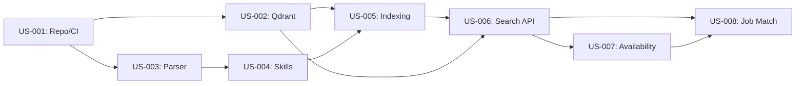

# User Stories - Specifiche Dettagliate

> Questo documento contiene le specifiche tecniche complete per le prime 8 User Stories del MVP ProfileBot.

---

## US-001: Setup Repository e CI/CD

**Epic:** Infrastructure Setup
**Story Points:** 3
**Priority:** P0 - Critical
**Sprint:** 1
**Feature Branch:** `feature/US-001-repo-cicd`

### User Story
**Come** sviluppatore
**Voglio** un repository Git configurato con CI/CD
**Per** poter collaborare e deployare in modo automatizzato

### Acceptance Criteria
- [x] Repository GitHub creato con struttura standard
- [x] Branch protection su `main` (require PR, require CI pass)
- [x] GitHub Actions workflow per lint e test
- [x] Pre-commit hooks configurati (ruff, black, mypy)
- [x] Makefile con comandi standard
- [x] pyproject.toml con dipendenze e configurazioni tool

### Technical Details

**Stack:**
- Package Manager: `uv`
- Linting: ruff, flake8, pylint, mypy
- Formatting: black, isort
- Security: bandit
- Pre-commit: pre-commit framework

**File da creare/modificare:**
```
├── .github/
│   └── workflows/ci.yml
├── .pre-commit-config.yaml
├── pyproject.toml
├── Makefile
└── README.md
```

**CI Pipeline Steps:**
1. Checkout code
2. Setup Python + uv
3. Install dependencies
4. Run linters (ruff, flake8, mypy, pylint)
5. Run tests (pytest)
6. Security scan (bandit)

### Definition of Done
- [x] CI pipeline verde su ogni commit
- [x] Pre-commit hooks funzionanti
- [x] Documentazione setup nel README
- [x] Branch protection attiva

---

## US-002: Setup Qdrant Vector Store

**Epic:** Infrastructure Setup
**Story Points:** 5
**Priority:** P0 - Critical
**Sprint:** 1
**Feature Branch:** `feature/US-002-qdrant-setup`

### User Story
**Come** data scientist
**Voglio** un'istanza Qdrant configurata
**Per** poter indicizzare e cercare i CV

### Acceptance Criteria
- [ ] Qdrant running via docker-compose
- [ ] Collection `cv_skills` creata con schema corretto
- [ ] Collection `cv_experiences` creata con schema corretto
- [ ] Script di inizializzazione collections
- [ ] Script di test connessione
- [ ] Health check endpoint

### Technical Details

**Stack:**
- Vector Store: Qdrant (latest)
- Client: `qdrant-client` Python SDK
- Container: Docker Compose

**Collection Schema - cv_skills:**
```python
{
    "name": "cv_skills",
    "vectors": {
        "size": 1536,  # OpenAI ada-002
        "distance": "Cosine"
    },
    "payload_schema": {
        "cv_id": "keyword",
        "section_type": "keyword",
        "normalized_skills": "keyword[]",
        "skill_domain": "keyword",
        "seniority_bucket": "keyword",
        "dictionary_version": "keyword",
        "created_at": "datetime"
    }
}
```

**Collection Schema - cv_experiences:**
```python
{
    "name": "cv_experiences",
    "vectors": {
        "size": 1536,
        "distance": "Cosine"
    },
    "payload_schema": {
        "cv_id": "keyword",
        "section_type": "keyword",
        "related_skills": "keyword[]",
        "experience_years": "integer",
        "created_at": "datetime"
    }
}
```

**File da creare:**
```
├── docker-compose.yml (aggiungere Qdrant service)
├── src/services/qdrant/
│   ├── __init__.py
│   ├── client.py          # Singleton client
│   ├── collections.py     # Schema definitions
│   └── health.py          # Health check
├── scripts/
│   └── init_qdrant.py     # Initialize collections
└── tests/
    └── test_qdrant_connection.py
```

**docker-compose.yml snippet:**
```yaml
services:
  qdrant:
    image: qdrant/qdrant:latest
    ports:
      - "6333:6333"
      - "6334:6334"
    volumes:
      - qdrant_data:/qdrant/storage
    environment:
      - QDRANT__SERVICE__GRPC_PORT=6334
```

### Process
1. Aggiungere Qdrant a docker-compose
2. Creare client wrapper con connection pooling
3. Definire schema collections con payload index
4. Creare script di inizializzazione
5. Aggiungere health check a FastAPI
6. Scrivere integration test

### Definition of Done
- [ ] `make docker-up` avvia Qdrant
- [ ] Collections create con schema corretto
- [ ] `/health` endpoint include Qdrant status
- [ ] Test connessione passa in CI
- [ ] README aggiornato con setup Qdrant

---

## US-003: Parser CV DOCX

**Epic:** Document Ingestion
**Story Points:** 8
**Priority:** P0 - Critical
**Sprint:** 1
**Feature Branch:** `feature/US-003-cv-parser`

### User Story
**Come** sistema
**Voglio** estrarre testo strutturato dai CV in formato DOCX
**Per** poter processare i curriculum aziendali

### Acceptance Criteria
- [ ] Parsing sezioni: Skills, Esperienze, Formazione, Certificazioni
- [ ] Estrazione metadata: nome, cognome, ruolo attuale
- [ ] Gestione errori per file malformati o corrotti
- [ ] Supporto encoding UTF-8 e caratteri speciali
- [ ] Unit test con almeno 5 CV di esempio
- [ ] Performance: < 2 sec per CV

### Technical Details

**Stack:**
- DOCX Parsing: `python-docx`
- Text Processing: regex, spacy (optional)
- Validation: pydantic

**Output Schema:**
```python
from pydantic import BaseModel
from typing import Optional
from datetime import date

class CVMetadata(BaseModel):
    cv_id: str
    file_name: str
    full_name: Optional[str]
    current_role: Optional[str]
    parsed_at: datetime

class SkillSection(BaseModel):
    raw_text: str
    skill_keywords: list[str]  # Keywords estratte

class ExperienceItem(BaseModel):
    company: Optional[str]
    role: Optional[str]
    start_date: Optional[date]
    end_date: Optional[date]
    description: str

class ParsedCV(BaseModel):
    metadata: CVMetadata
    skills: SkillSection
    experiences: list[ExperienceItem]
    education: list[str]
    certifications: list[str]
    raw_text: str  # Full text for fallback
```

**File da creare:**
```
├── src/core/parser/
│   ├── __init__.py
│   ├── docx_parser.py     # Main parser
│   ├── section_detector.py # Section identification
│   ├── metadata_extractor.py
│   └── schemas.py         # Pydantic models
├── tests/
│   ├── fixtures/
│   │   └── sample_cvs/    # 5+ sample CVs
│   └── test_cv_parser.py
└── docs/
    └── cv_format_guide.md  # Expected CV format
```

**Section Detection Strategy:**
```python
SECTION_PATTERNS = {
    "skills": [
        r"(?i)^(competenze|skills?|technical skills?|conoscenze)",
        r"(?i)^(tecnologie|tools?|linguaggi)"
    ],
    "experience": [
        r"(?i)^(esperienza|experience|work history|career)",
        r"(?i)^(esperienze professionali|professional)"
    ],
    "education": [
        r"(?i)^(formazione|education|istruzione|studi)"
    ],
    "certifications": [
        r"(?i)^(certificazioni|certifications?|qualifiche)"
    ]
}
```

### Process
1. Leggere DOCX con python-docx
2. Estrarre tutti i paragrafi con stili
3. Identificare sezioni tramite heading/pattern
4. Parsare ogni sezione con logica specifica
5. Estrarre metadata da header/footer
6. Validare con Pydantic
7. Gestire errori con logging dettagliato

### Edge Cases da Gestire
- CV senza sezioni chiare (usare euristica)
- Tabelle con skill
- Immagini (skip con warning)
- File protetti da password
- Encoding non-UTF8

### Definition of Done
- [ ] Parser estrae tutte le sezioni
- [ ] Almeno 5 CV di test diversi
- [ ] Coverage test ≥ 80%
- [ ] Gestione errori documentata
- [ ] Performance validata (< 2 sec/CV)

---

## US-004: Skill Extraction e Normalizzazione

**Epic:** Document Ingestion
**Story Points:** 13
**Priority:** P0 - Critical
**Sprint:** 2
**Feature Branch:** `feature/US-004-skill-extraction`

### User Story
**Come** data scientist
**Voglio** estrarre e normalizzare le skill dai CV
**Per** avere un vocabolario controllato di competenze

### Acceptance Criteria
- [ ] Dizionario skill base con 100+ entry
- [ ] Mapping sinonimi → skill normalizzate
- [ ] Confidence score per ogni mapping (0.0-1.0)
- [ ] Log skill non riconosciute per review
- [ ] Categorizzazione skill per domain
- [ ] Versioning dizionario

### Technical Details

**Stack:**
- Matching: fuzzy matching (`rapidfuzz`), regex
- NLP (optional): spacy per NER
- Storage: YAML/JSON per dizionario

**Skill Dictionary Schema:**
```yaml
# skills_dictionary.yaml
version: "1.0.0"
updated_at: "2025-02-05"

domains:
  - backend
  - frontend
  - data
  - devops
  - management

skills:
  python:
    canonical: "python"
    domain: "backend"
    aliases:
      - "py"
      - "python3"
      - "python 3"
    related:
      - "django"
      - "fastapi"
      - "flask"

  project_management:
    canonical: "project_management"
    domain: "management"
    aliases:
      - "pm"
      - "project manager"
      - "gestione progetti"
    certifications:
      - "PMP"
      - "Prince2"

  # ... 100+ entries
```

**Output Schema:**
```python
class NormalizedSkill(BaseModel):
    original: str           # "Python 3.x"
    canonical: str          # "python"
    domain: str             # "backend"
    confidence: float       # 0.95
    match_type: str         # "exact" | "fuzzy" | "alias"

class SkillExtractionResult(BaseModel):
    cv_id: str
    normalized_skills: list[NormalizedSkill]
    unknown_skills: list[str]  # Per review manuale
    dictionary_version: str
```

**File da creare:**
```
├── src/core/skills/
│   ├── __init__.py
│   ├── extractor.py       # Main extraction logic
│   ├── normalizer.py      # Normalization engine
│   ├── dictionary.py      # Dictionary loader
│   └── schemas.py
├── data/
│   └── skills_dictionary.yaml
├── tests/
│   └── test_skill_extraction.py
└── scripts/
    └── analyze_unknown_skills.py  # Report unknown
```

**Matching Strategy:**
```python
def normalize_skill(raw_skill: str, dictionary: dict) -> NormalizedSkill:
    # 1. Exact match (confidence: 1.0)
    # 2. Alias match (confidence: 0.95)
    # 3. Fuzzy match (confidence: based on ratio)
    # 4. Unknown (logged for review)
```

### Process
1. Caricare dizionario skill (versioned)
2. Per ogni skill raw dal parser:
   - Lowercase e normalizza whitespace
   - Cerca match esatto
   - Cerca tra alias
   - Fuzzy matching con threshold 0.85
   - Se no match → log come unknown
3. Assegnare confidence score
4. Categorizzare per domain
5. Generare report skill sconosciute

### Definition of Done
- [ ] Dizionario con 100+ skill
- [ ] Mapping testato su 50+ skill reali
- [ ] Confidence score coerente
- [ ] Script report unknown skills
- [ ] Unit test per edge cases

---

## US-005: Embedding e Indexing Pipeline

**Epic:** Document Ingestion
**Story Points:** 13
**Priority:** P0 - Critical
**Sprint:** 2
**Feature Branch:** `feature/US-005-embedding-pipeline`

### User Story
**Come** sistema
**Voglio** generare embedding e indicizzare in Qdrant
**Per** abilitare la ricerca semantica

### Acceptance Criteria
- [ ] Embedding con OpenAI text-embedding-ada-002 (o alternative)
- [ ] Upsert in collection `cv_skills` con payload completo
- [ ] Upsert in collection `cv_experiences` con payload completo
- [ ] Metadata completi su ogni punto
- [ ] Pipeline idempotente (re-run safe)
- [ ] Batch processing per performance

### Technical Details

**Stack:**
- Embedding: OpenAI API o `sentence-transformers`
- Vector Store: Qdrant
- Queue (optional): Redis per async processing

**Embedding Models:**
```python
# Opzione 1: OpenAI (recommended)
EMBEDDING_MODEL = "text-embedding-ada-002"
EMBEDDING_DIM = 1536

# Opzione 2: Open Source
EMBEDDING_MODEL = "sentence-transformers/all-MiniLM-L6-v2"
EMBEDDING_DIM = 384
```

**Pipeline Flow:**
```
ParsedCV
    │
    ├──► Skill Section ──► Embedding ──► cv_skills collection
    │
    └──► Experience Items ──► Embedding (each) ──► cv_experiences collection
```

**Point Schema per cv_skills:**
```python
{
    "id": "cv_001_skills",  # Deterministic ID for idempotency
    "vector": [...],        # 1536 dim
    "payload": {
        "cv_id": "cv_001",
        "section_type": "skills",
        "normalized_skills": ["python", "fastapi", "postgresql"],
        "skill_domain": "backend",
        "seniority_bucket": "senior",
        "raw_text": "Python, FastAPI, PostgreSQL...",
        "dictionary_version": "1.0.0",
        "indexed_at": "2025-02-05T10:30:00Z"
    }
}
```

**File da creare:**
```
├── src/services/embedding/
│   ├── __init__.py
│   ├── embedder.py        # Embedding generation
│   ├── openai_client.py   # OpenAI wrapper
│   └── local_embedder.py  # Sentence transformers fallback
├── src/core/indexing/
│   ├── __init__.py
│   ├── pipeline.py        # Main orchestrator
│   ├── cv_indexer.py      # CV-specific logic
│   └── batch_processor.py # Batch handling
├── scripts/
│   ├── index_single_cv.py
│   └── index_all_cvs.py
└── tests/
    └── test_indexing_pipeline.py
```

**Idempotency Strategy:**
```python
def generate_point_id(cv_id: str, section: str) -> str:
    """Deterministic ID for upsert idempotency"""
    return f"{cv_id}_{section}"

# Upsert will update if exists, insert if new
qdrant_client.upsert(
    collection_name="cv_skills",
    points=[point],
    wait=True
)
```

### Process
1. Ricevere ParsedCV
2. Estrarre sezione skill → generare embedding
3. Preparare payload con metadata
4. Upsert in cv_skills (idempotent)
5. Per ogni esperienza:
   - Generare embedding
   - Upsert in cv_experiences
6. Log successo/errori

### Performance Considerations
- Batch embedding (max 100 texts per request)
- Async upsert con retry
- Rate limiting per OpenAI API
- Caching embeddings (optional)

### Definition of Done
- [ ] Pipeline end-to-end funzionante
- [ ] Metadata completi su ogni punto
- [ ] Re-run non duplica dati
- [ ] Performance: < 5 sec per CV
- [ ] Test con 10+ CV reali

---

## US-006: API Ricerca Profili per Skill

**Epic:** Search & Matching
**Story Points:** 8
**Priority:** P1 - High
**Sprint:** 3
**Feature Branch:** `feature/US-006-search-api`

### User Story
**Come** utente
**Voglio** cercare profili in base a skill richieste
**Per** trovare candidati con competenze specifiche

### Acceptance Criteria
- [ ] Endpoint `POST /api/v1/search/skills`
- [ ] Input: lista skill, filtri opzionali (seniority, domain)
- [ ] Output: lista profili ranked con score
- [ ] Paginazione risultati (limit, offset)
- [ ] Response time < 500ms per query standard
- [ ] OpenAPI documentation

### Technical Details

**Stack:**
- API: FastAPI
- Validation: Pydantic
- Docs: OpenAPI 3.0

**Request Schema:**
```python
class SkillSearchRequest(BaseModel):
    skills: list[str]                    # ["python", "fastapi"]
    filters: Optional[SearchFilters]
    limit: int = 10
    offset: int = 0

class SearchFilters(BaseModel):
    skill_domains: Optional[list[str]]   # ["backend", "data"]
    seniority: Optional[list[str]]       # ["senior", "mid"]
    availability: Optional[str]          # "only_free" | "any"
```

**Response Schema:**
```python
class ProfileMatch(BaseModel):
    cv_id: str
    score: float                         # 0.0 - 1.0
    matched_skills: list[str]
    missing_skills: list[str]
    skill_domain: str
    seniority: str

class SkillSearchResponse(BaseModel):
    results: list[ProfileMatch]
    total: int
    limit: int
    offset: int
    query_time_ms: int
```

**File da creare:**
```
├── src/api/
│   ├── __init__.py
│   ├── main.py            # FastAPI app
│   └── v1/
│       ├── __init__.py
│       ├── router.py      # Main router
│       ├── search.py      # Search endpoints
│       └── schemas.py     # Request/Response models
├── src/services/search/
│   ├── __init__.py
│   ├── skill_search.py    # Search logic
│   └── scoring.py         # Score calculation
└── tests/
    └── api/
        └── test_search_endpoints.py
```

**Search Flow:**
```python
async def search_by_skills(request: SkillSearchRequest) -> SkillSearchResponse:
    # 1. Normalizza skill input
    normalized = normalize_skills(request.skills)

    # 2. Genera embedding query
    query_embedding = embed_skills(normalized)

    # 3. Query Qdrant con filtri
    results = await qdrant.search(
        collection="cv_skills",
        query_vector=query_embedding,
        query_filter=build_filters(request.filters),
        limit=request.limit + request.offset
    )

    # 4. Calcola score e matched skills
    matches = calculate_matches(results, normalized)

    # 5. Pagina e restituisci
    return paginate(matches, request.limit, request.offset)
```

### Process
1. Definire schemas OpenAPI
2. Implementare endpoint FastAPI
3. Integrare con Qdrant search
4. Aggiungere filtering logic
5. Implementare paginazione
6. Scrivere integration test
7. Documentare API

### Definition of Done
- [ ] Endpoint funzionante e documentato
- [ ] Response < 500ms (testato)
- [ ] Paginazione corretta
- [ ] Test coverage ≥ 80%
- [ ] OpenAPI spec validata

---

## US-007: Filtro Disponibilità

**Epic:** Search & Matching
**Story Points:** 5
**Priority:** P1 - High
**Sprint:** 3
**Feature Branch:** `feature/US-007-availability-filter`

### User Story
**Come** utente
**Voglio** filtrare i profili per stato di disponibilità
**Per** vedere solo candidati effettivamente assegnabili

### Acceptance Criteria
- [ ] Filtri: `only_free`, `free_or_partial`, `any`
- [ ] Integrazione con source stato operativo (SharePoint/Excel)
- [ ] Cache stato con TTL configurabile
- [ ] Risposta esplicita se nessuno disponibile
- [ ] Aggiornamento stato asincrono

### Technical Details

**Stack:**
- Cache: Redis
- Data Source: SharePoint List / Excel file (inizialmente)
- Scheduler: APScheduler (per refresh)

**Availability States:**
```python
class AvailabilityStatus(str, Enum):
    FREE = "free"           # Completamente disponibile
    PARTIAL = "partial"     # Allocato parzialmente
    BUSY = "busy"           # Allocato su progetto
    UNAVAILABLE = "unavailable"  # Non disponibile (ferie, malattia)
```

**Operational State Schema:**
```python
class ProfileAvailability(BaseModel):
    cv_id: str
    status: AvailabilityStatus
    allocation_percentage: int  # 0-100
    current_project: Optional[str]
    available_from: Optional[date]
    updated_at: datetime
```

**File da creare:**
```
├── src/services/availability/
│   ├── __init__.py
│   ├── service.py         # Main service
│   ├── cache.py           # Redis cache layer
│   ├── source_sharepoint.py  # SharePoint adapter
│   └── source_excel.py    # Excel fallback
├── src/core/filters/
│   ├── __init__.py
│   └── availability_filter.py
└── tests/
    └── test_availability_service.py
```

**Filter Integration:**
```python
class AvailabilityFilter:
    def __init__(self, mode: str):
        self.mode = mode  # "only_free" | "free_or_partial" | "any"

    def filter_cv_ids(self, cv_ids: list[str]) -> list[str]:
        """Filter CV IDs based on availability"""
        if self.mode == "any":
            return cv_ids

        availability_data = cache.get_availability(cv_ids)

        if self.mode == "only_free":
            return [cv for cv in cv_ids
                    if availability_data[cv].status == "free"]

        if self.mode == "free_or_partial":
            return [cv for cv in cv_ids
                    if availability_data[cv].status in ("free", "partial")]
```

**Cache Strategy:**
```python
# Redis key pattern
AVAILABILITY_KEY = "availability:{cv_id}"
AVAILABILITY_TTL = 3600  # 1 hour

async def get_availability(cv_id: str) -> ProfileAvailability:
    # Try cache first
    cached = await redis.get(f"availability:{cv_id}")
    if cached:
        return ProfileAvailability.parse_raw(cached)

    # Fallback to source
    data = await source.fetch_availability(cv_id)
    await redis.setex(f"availability:{cv_id}", AVAILABILITY_TTL, data.json())
    return data
```

### Process
1. Definire schema stati disponibilità
2. Implementare adapter per source (Excel inizialmente)
3. Creare cache layer Redis
4. Integrare filtro nella search API
5. Aggiungere scheduler per refresh periodico
6. Gestire caso "nessuno disponibile"

### Definition of Done
- [ ] Filtri funzionanti su tutti i modi
- [ ] Cache Redis operativa
- [ ] Refresh automatico configurato
- [ ] Messaggio esplicito se 0 risultati
- [ ] Test con dati mock

---

## US-008: Match con Job Description

**Epic:** Search & Matching
**Story Points:** 13
**Priority:** P1 - High
**Sprint:** 4
**Feature Branch:** `feature/US-008-job-match`

### User Story
**Come** utente
**Voglio** trovare il miglior profilo per una job description
**Per** proporre candidati ad opportunità specifiche

### Acceptance Criteria
- [ ] Endpoint `POST /api/v1/match/job`
- [ ] Input: testo job description (free text)
- [ ] Estrazione automatica skill richieste dalla JD
- [ ] Ranking profili con spiegazione LLM
- [ ] Output strutturato con motivazione per ogni match
- [ ] Distinzione tra must-have e nice-to-have skills

### Technical Details

**Stack:**
- LLM: OpenAI GPT-4 / Azure OpenAI
- Extraction: LLM-based skill extraction
- Ranking: Vector similarity + LLM reasoning

**Request Schema:**
```python
class JobMatchRequest(BaseModel):
    job_description: str              # Free text JD
    max_candidates: int = 5
    availability_filter: str = "free_or_partial"
    include_explanation: bool = True
```

**Response Schema:**
```python
class SkillRequirement(BaseModel):
    skill: str
    importance: str  # "must_have" | "nice_to_have"

class CandidateMatch(BaseModel):
    cv_id: str
    overall_score: float
    matched_skills: list[str]
    missing_skills: list[str]
    explanation: str  # LLM-generated
    strengths: list[str]
    gaps: list[str]

class JobMatchResponse(BaseModel):
    extracted_requirements: list[SkillRequirement]
    candidates: list[CandidateMatch]
    no_match_reason: Optional[str]  # If 0 candidates
```

**File da creare:**
```
├── src/api/v1/
│   └── job_match.py       # Endpoint
├── src/services/matching/
│   ├── __init__.py
│   ├── job_analyzer.py    # JD skill extraction
│   ├── candidate_ranker.py # Ranking logic
│   └── explainer.py       # LLM explanations
├── src/core/llm/
│   ├── __init__.py
│   ├── client.py          # LLM client wrapper
│   └── prompts.py         # System/user prompts
└── tests/
    └── test_job_matching.py
```

**JD Skill Extraction Prompt:**
```python
JD_EXTRACTION_PROMPT = """
Analizza la seguente job description ed estrai le skill richieste.

Job Description:
{job_description}

Restituisci un JSON con:
{{
    "must_have": ["skill1", "skill2"],
    "nice_to_have": ["skill3", "skill4"],
    "seniority": "junior|mid|senior",
    "domain": "backend|frontend|data|devops|management"
}}

Usa solo skill dal vocabolario standard. Non inventare skill.
"""
```

**Matching Flow:**
```
Job Description
      │
      ▼
┌─────────────────┐
│ LLM Extraction  │ ──► Required Skills + Filters
└─────────────────┘
      │
      ▼
┌─────────────────┐
│ Vector Search   │ ──► Candidate Shortlist (K=20)
└─────────────────┘
      │
      ▼
┌─────────────────┐
│ Availability    │ ──► Filtered Candidates
│ Filter          │
└─────────────────┘
      │
      ▼
┌─────────────────┐
│ LLM Ranking     │ ──► Top N with Explanations
└─────────────────┘
```

**LLM Decision Prompt:**
```python
RANKING_PROMPT = """
Sei un assistente per il matching professionale.
La selezione deve basarsi PRINCIPALMENTE sulle skill.
Le esperienze servono solo come supporto.

Job Requirements:
{requirements}

Candidate Profiles:
{profiles}

Per ogni candidato fornisci:
1. Score (0-100)
2. Skill matchate
3. Skill mancanti
4. Breve motivazione (2-3 frasi)

Output JSON:
{{
    "rankings": [
        {{
            "cv_id": "...",
            "score": 85,
            "matched": ["python", "fastapi"],
            "missing": ["kubernetes"],
            "explanation": "..."
        }}
    ]
}}
"""
```

### Process
1. Ricevere JD text
2. Estrarre skill con LLM (must-have/nice-to-have)
3. Normalizzare skill estratte
4. Vector search su cv_skills
5. Applicare filtro disponibilità
6. Recuperare esperienze per shortlist
7. LLM ranking con spiegazioni
8. Formattare response

### LLM Parameters
- Model: GPT-4 / GPT-4-turbo
- Temperature: 0.1 (deterministic)
- Max tokens: 2000
- Response format: JSON mode

### Definition of Done
- [ ] Endpoint funzionante end-to-end
- [ ] Estrazione skill accurata (test su 5 JD)
- [ ] Spiegazioni coerenti e utili
- [ ] Response time < 10 sec
- [ ] Test con JD reali

---

## Dipendenze tra User Stories



---

## Quick Reference: Feature Branches

| US | Branch | Sprint |
|----|--------|--------|
| US-001 | `feature/US-001-repo-cicd` | 1 |
| US-002 | `feature/US-002-qdrant-setup` | 1 |
| US-003 | `feature/US-003-cv-parser` | 1 |
| US-004 | `feature/US-004-skill-extraction` | 2 |
| US-005 | `feature/US-005-embedding-pipeline` | 2 |
| US-006 | `feature/US-006-search-api` | 3 |
| US-007 | `feature/US-007-availability-filter` | 3 |
| US-008 | `feature/US-008-job-match` | 4 |
