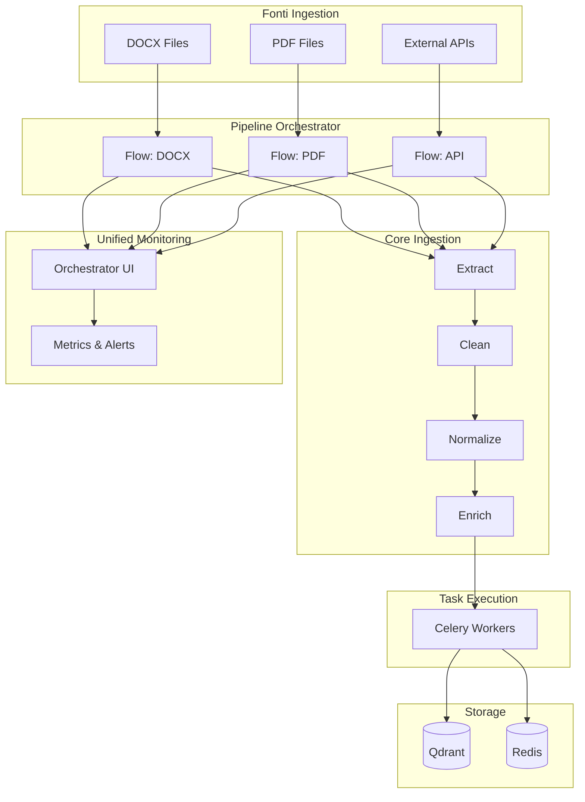

# Technical Debt — User Stories (Ingestion Evolution Readiness)

> **Premessa:** le fonti di ingestion possono crescere nel tempo e cambiare formato (DOCX, PDF, HTML, CSV, API, DB, ecc.). L’architettura deve essere pronta a gestire nuovi connettori, variazioni di schema e trasformazioni senza impatti diffusi sul core.

---

## TD-001 — Ingestion Abstraction & Connector Contract

**Titolo:** Definire un contratto unico per le fonti di ingestion  
**Motivazione:** nuove fonti richiedono standardizzazione di input, metadata e error handling  
**Obiettivo:** introdurre un’interfaccia comune per connettori e parser con output coerente

### Architettura da usare/modificare
- Introduzione di un contratto `IngestionSource` (protocol/interface) nel layer `services`:
  - `fetch()` → raw content + metadata
  - `validate()` → schema/format check
  - `normalize()` → output standard per il core
- Output standard: `RawDocument` + `IngestionMetadata` (con `source_type`, `schema_version`, `content_type`)
- Conversione in `core` solo dopo `normalize()`

### Componenti da aggiornare/refactorizzare/aggiungere
- **Aggiungere**
  - `src/services/ingestion/__init__.py`
  - `src/services/ingestion/contracts.py` → protocol `IngestionSource`
  - `src/services/ingestion/schemas.py` → `RawDocument`, `IngestionMetadata`
  - `src/services/ingestion/errors.py` → errori specifici (es. `IngestionFetchError`)
- **Refactor**
  - `src/core/parser/docx_parser.py` → migrare a `IngestionSource` per output normalizzato
  - `src/core/parser/metadata_extractor.py` → spostare metadata in `IngestionMetadata`
  - `src/core/parser/schemas.py` → adattare a `RawDocument`/metadata
- **Aggiornare**
  - `src/services/embedding/tasks.py` o pipeline di ingestion per usare il contratto
  - `tests/test_cv_parser.py` → verificare output standardizzato
  - `tests/test_embedding_pipeline.py` → input normalizzato obbligatorio

### Anti‑pattern da evitare (o rimuovere)
- Parsing diretto in API layer (endpoints che fanno parsing)
- Connettori che restituiscono tipi diversi per la stessa sorgente
- Eccezioni generiche in `fetch()` senza classi di errore specifiche
- Coupling tra parser e storage (es. parser che scrive direttamente su Qdrant)

### Acceptance Criteria
- [ ] Esiste un contratto formale per le fonti di ingestion
- [ ] Almeno 1 connettore esistente è migrato al nuovo contratto
- [ ] Output standardizzato verificabile via test
- [ ] `core` accetta solo output normalizzato

---

## TD-002 — Schema Evolution & Metadata Versioning

**Titolo:** Versionare schema e metadata di ingestion  
**Motivazione:** formati e campi cambiano, serve tracciabilità nel tempo  
**Obiettivo:** introdurre versione schema e mapping per compatibilità

### Architettura da usare/modificare
- `schema_version` obbligatorio in `IngestionMetadata`
- `source_type` obbligatorio per routing di pipeline
- Mapping dichiarativo `vN → vN+1` con regole di conversione
- Persistenza di `schema_version` in Qdrant payload

### Componenti da aggiornare/refactorizzare/aggiungere
- **Aggiungere**
  - `src/core/ingestion/schema_versioning.py` → mapping e migrazione
  - `src/core/ingestion/constants.py` → versioni correnti per source type
- **Refactor**
  - `src/core/parser/metadata_extractor.py` → inserire `schema_version`
  - `src/core/parser/schemas.py` → estendere metadata
- **Aggiornare**
  - `src/services/qdrant/collections.py` → payload con `schema_version`
  - `src/core/embedding/pipeline.py` → passare `schema_version` al payload
  - `tests/test_embedding_pipeline.py` → assert `schema_version` nel payload

### Anti‑pattern da evitare (o rimuovere)
- Sovrascrivere documenti senza conservare `schema_version`
- Normalizzare “al volo” senza traccia del mapping
- Hardcode di versioni dentro i parser
- Ingestion che ignora metadata se “non utili”

### Acceptance Criteria
- [ ] Ogni documento ingestito include `schema_version`
- [ ] Esiste un mapping esplicito per 1 formato legacy
- [ ] Test di regressione coprono una variazione di schema
- [ ] Qdrant payload include `schema_version`

---

## TD-003 — Transformation Pipeline Modularization

**Titolo:** Modularizzare la pipeline di trasformazione pre‑core  
**Motivazione:** nuovi formati richiedono step variabili (OCR, parsing, cleaning)  
**Obiettivo:** pipeline configurabile, step plug‑in, riduzione coupling

### Architettura da usare/modificare
- Pipeline composta da step indipendenti:
  - `extract` → `clean` → `normalize` → `enrich`
- Configurazione per `source_type` (YAML o config code)
- Step con interfaccia comune `process(input) -> output`
- Logging per step (tempo, dimensione output, warning)

### Componenti da aggiornare/refactorizzare/aggiungere
- **Aggiungere**
  - `src/core/ingestion/pipeline.py` → orchestrazione step
  - `src/core/ingestion/steps/__init__.py`
  - `src/core/ingestion/steps/extract.py`
  - `src/core/ingestion/steps/clean.py`
  - `src/core/ingestion/steps/normalize.py`
  - `src/core/ingestion/steps/enrich.py`
  - `src/core/ingestion/config.py` → config per `source_type`
- **Refactor**
  - `src/core/parser/section_detector.py` → diventare step `extract`
  - `src/core/parser/docx_parser.py` → delegare a pipeline
- **Aggiornare**
  - `tests/test_cv_parser.py` → test step isolati
  - `tests/test_embedding_pipeline.py` → pipeline pre‑core

### Anti‑pattern da evitare (o rimuovere)
- Pipeline monolitica e sequenze hardcoded
- Step con side effects non dichiarati
- OCR o cleaning dentro parser principale
- Output che cambia struttura tra step senza contratto

### Acceptance Criteria
- [ ] Pipeline composabile con step configurabili
- [ ] Almeno 2 source type con pipeline diversa
- [ ] Logging step-by-step attivo e tracciabile
- [ ] Step testabili in isolamento

---

## TD-004 — Resilience & Monitoring for Ingestion Changes

**Titolo:** Robustezza e osservabilità su ingestion dinamiche  
**Motivazione:** nuove fonti aumentano rischio di errori silenziosi  
**Obiettivo:** circuit‑breaker, metriche e alerting sulle pipeline

### Architettura da usare/modificare
- Metriche per `source_type`: success/failure, latency, error class
- Alert su spike di errori o formati sconosciuti
- Retry policy controllata (backoff + max attempts)
- Classificazione errori (input invalid vs transient vs internal)

### Componenti da aggiornare/refactorizzare/aggiungere
- **Aggiungere**
  - `src/utils/metrics.py` → metriche ingestion (success/failure/latency)
  - `src/utils/retry.py` → policy retry condivisa
  - `src/services/ingestion/monitoring.py` → logging strutturato
- **Refactor**
  - `src/services/embedding/tasks.py` → classificazione errori ingestion
  - `src/core/embedding/pipeline.py` → cattura errori con classi specifiche
- **Aggiornare**
  - `tests/test_celery_tasks.py` → retry + error class
  - `tests/test_embedding_pipeline.py` → metriche emission

### Anti‑pattern da evitare (o rimuovere)
- Retry infinito senza backoff
- Errori loggati senza contesto di `source_type`
- Silenziare errori di parsing per “non interrompere”
- Uso di `except Exception` senza classificazione

### Acceptance Criteria
- [ ] Metriche ingestion esposte e monitorabili
- [ ] Alerting configurato su errori per source type
- [ ] Retry policy definita per almeno 1 fonte instabile
- [ ] Errori classificati e tracciabili

---

## TD-005 — Pipeline Orchestrator & Unified Monitoring

**Titolo:** Introdurre un orchestratore per pipeline con monitoring unificato  
**Motivazione:** la crescita delle fonti e dei formati richiede coordinamento, retry e visibilità end‑to‑end  
**Obiettivo:** centralizzare la gestione delle pipeline (per source type) con UI di osservabilità

### Architettura da usare/modificare
- Orchestratore (es. Prefect/Dagster) come livello di controllo dei flow
- Flussi definiti per `source_type` con step modulari (TD-003)
- Integrazione con Celery per task heavy, mantenendo orchestration esterna
- UI unica per stato pipeline, tempi, errori e retry

### Schema architetturale (Mermaid)

### Componenti da aggiornare/refactorizzare/aggiungere
- **Aggiungere**
  - `src/services/orchestrator/__init__.py`
  - `src/services/orchestrator/flows.py` → definizione dei flow per source type
  - `src/services/orchestrator/config.py` → mapping source → flow
- **Refactor**
  - `src/services/embedding/tasks.py` → invocazione tramite orchestratore
  - `src/core/ingestion/pipeline.py` → step invocabili dai flow
- **Aggiornare**
  - `tests/test_embedding_pipeline.py` → verifica invocazione flow
  - `tests/test_celery_tasks.py` → integrazione orchestratore ↔ worker

### Anti‑pattern da evitare (o rimuovere)
- Logica di orchestrazione sparsa tra API e task
- Flow duplicati con differenze minime non dichiarate
- Monitoring frammentato in più dashboard non correlate
- Retry gestiti localmente senza visibilità end‑to‑end

### Acceptance Criteria
- [ ] Orchestratore definisce flow per almeno 2 source type
- [ ] UI mostra stato e tempi delle pipeline
- [ ] Retry centralizzati e tracciabili
- [ ] Integrazione con Celery operativa

---

## Notes
Queste storie sono la base per le future issue GitHub e dovranno evolvere in task più granulari per ciascun connettore e pipeline.