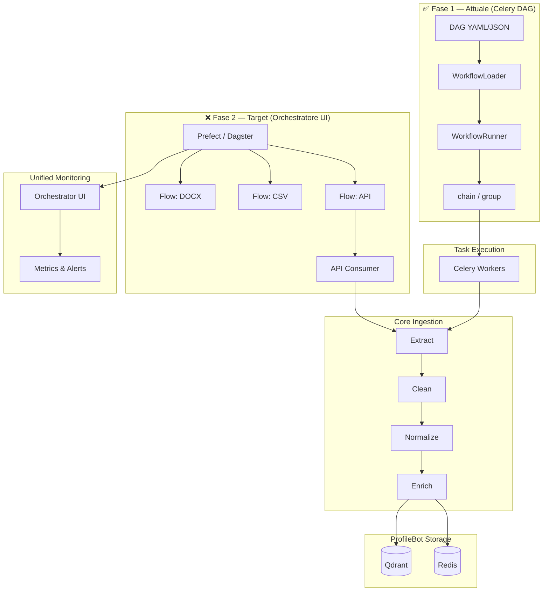
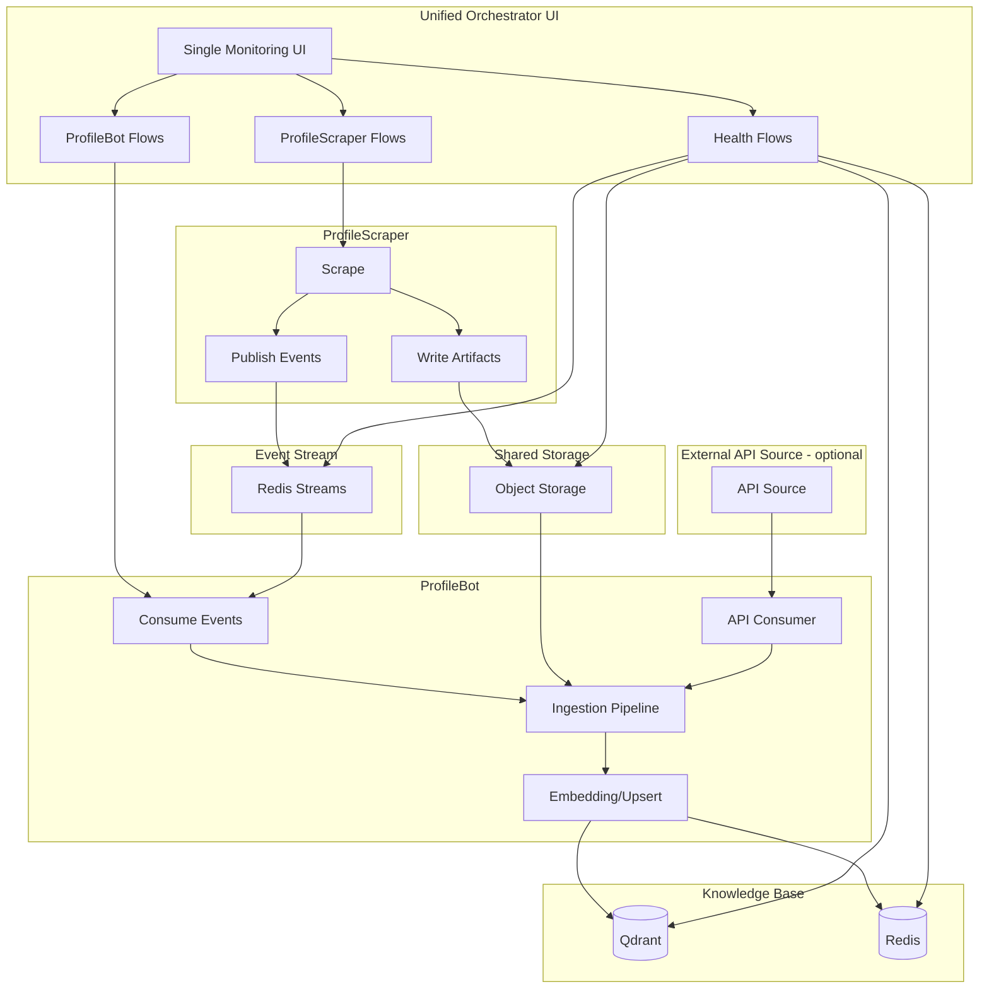
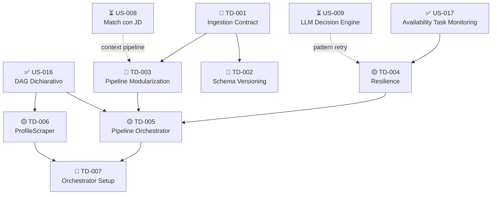

# Technical Debt — User Stories (Ingestion Evolution Readiness)

> **Premessa:** le fonti di ingestion possono crescere nel tempo e cambiare formato (DOCX, PDF, HTML, CSV, API, DB, ecc.). L'architettura deve essere pronta a gestire nuovi connettori, variazioni di schema e trasformazioni senza impatti diffusi sul core.

> **Ultimo aggiornamento:** 27 febbraio 2026 — Sprint 6 KP Foundation avviato, issue TD-001 ([#47](https://github.com/giamma80/profilebot/issues/47)) e TD-004 ([#48](https://github.com/giamma80/profilebot/issues/48)) create.

---

## Stato Complessivo

| TD | Titolo | Stato | Note |
|----|--------|-------|------|
| TD-001 | Ingestion Abstraction & Connector Contract | 🔵 Sprint 6 [#47](https://github.com/giamma80/profilebot/issues/47) | Prerequisito per TD-002, TD-003 |
| TD-002 | Schema Evolution & Metadata Versioning | 🔴 Non iniziato | Dipende da TD-001 |
| TD-003 | Transformation Pipeline Modularization | 🔴 Non iniziato | Dipende da TD-001 |
| TD-004 | Resilience & Monitoring for Ingestion Changes | 🔵 Sprint 6 [#48](https://github.com/giamma80/profilebot/issues/48) | Retry presenti; metriche + circuit breaker in Sprint 6 |
| TD-005 | Pipeline Orchestrator & Unified Monitoring | 🟡 Parziale | DAG dichiarativo implementato (US-016); manca evoluzione verso orchestratore UI-based |
| TD-006 | External Producer Service (ProfileScraper) | 🟡 Parziale | ScraperClient REST implementato; manca separazione in servizio autonomo |
| TD-007 | Orchestrator Setup & End-to-End Observability | 🔴 Non iniziato | Dipende da TD-005 completato |

---

## TD-001 — Ingestion Abstraction & Connector Contract

**Titolo:** Definire un contratto unico per le fonti di ingestion
**Motivazione:** nuove fonti richiedono standardizzazione di input, metadata e error handling
**Obiettivo:** introdurre un'interfaccia comune per connettori e parser con output coerente
**Stato:** 🔵 Pianificato Sprint 6 — [#47](https://github.com/giamma80/profilebot/issues/47)

### Architettura da usare/modificare
- Introduzione di un contratto `IngestionSource` (protocol/interface) nel layer `services`:
  - `fetch()` → raw content + metadata
  - `validate()` → schema/format check
  - `normalize()` → output standard per il core
- Output standard: `RawDocument` + `IngestionMetadata` (con `source_type`, `schema_version`, `content_type`)
- Conversione in `core` solo dopo `normalize()`

### Componenti da aggiornare/refactorizzare/aggiungere
- **Aggiungere**
  - `src/services/ingestion/__init__.py`
  - `src/services/ingestion/contracts.py` → protocol `IngestionSource`
  - `src/services/ingestion/schemas.py` → `RawDocument`, `IngestionMetadata`
  - `src/services/ingestion/errors.py` → errori specifici (es. `IngestionFetchError`)
- **Refactor**
  - `src/core/parser/docx_parser.py` → migrare a `IngestionSource` per output normalizzato
  - `src/core/parser/metadata_extractor.py` → spostare metadata in `IngestionMetadata`
  - `src/core/parser/schemas.py` → adattare a `RawDocument`/metadata
- **Aggiornare**
  - `src/services/embedding/tasks.py` o pipeline di ingestion per usare il contratto
  - `tests/test_cv_parser.py` → verificare output standardizzato
  - `tests/test_embedding_pipeline.py` → input normalizzato obbligatorio

### Anti‑pattern da evitare (o rimuovere)
- Parsing diretto in API layer (endpoints che fanno parsing)
- Connettori che restituiscono tipi diversi per la stessa sorgente
- Eccezioni generiche in `fetch()` senza classi di errore specifiche
- Coupling tra parser e storage (es. parser che scrive direttamente su Qdrant)

### Acceptance Criteria
- [ ] Esiste un contratto formale per le fonti di ingestion
- [ ] Almeno 1 connettore esistente è migrato al nuovo contratto
- [ ] Output standardizzato verificabile via test
- [ ] `core` accetta solo output normalizzato

---

## TD-002 — Schema Evolution & Metadata Versioning

**Titolo:** Versionare schema e metadata di ingestion
**Motivazione:** formati e campi cambiano, serve tracciabilità nel tempo
**Obiettivo:** introdurre versione schema e mapping per compatibilità
**Stato:** 🔴 Non iniziato

### Architettura da usare/modificare
- `schema_version` obbligatorio in `IngestionMetadata`
- `source_type` obbligatorio per routing di pipeline
- Mapping dichiarativo `vN → vN+1` con regole di conversione
- Persistenza di `schema_version` in Qdrant payload

### Componenti da aggiornare/refactorizzare/aggiungere
- **Aggiungere**
  - `src/core/ingestion/schema_versioning.py` → mapping e migrazione
  - `src/core/ingestion/constants.py` → versioni correnti per source type
- **Refactor**
  - `src/core/parser/metadata_extractor.py` → inserire `schema_version`
  - `src/core/parser/schemas.py` → estendere metadata
- **Aggiornare**
  - `src/services/qdrant/collections.py` → payload con `schema_version`
  - `src/core/embedding/pipeline.py` → passare `schema_version` al payload
  - `tests/test_embedding_pipeline.py` → assert `schema_version` nel payload

### Anti‑pattern da evitare (o rimuovere)
- Sovrascrivere documenti senza conservare `schema_version`
- Normalizzare "al volo" senza traccia del mapping
- Hardcode di versioni dentro i parser
- Ingestion che ignora metadata se "non utili"

### Acceptance Criteria
- [ ] Ogni documento ingestito include `schema_version`
- [ ] Esiste un mapping esplicito per 1 formato legacy
- [ ] Test di regressione coprono una variazione di schema
- [ ] Qdrant payload include `schema_version`

---

## TD-003 — Transformation Pipeline Modularization

**Titolo:** Modularizzare la pipeline di trasformazione pre‑core
**Motivazione:** nuovi formati richiedono step variabili (OCR, parsing, cleaning)
**Obiettivo:** pipeline configurabile, step plug‑in, riduzione coupling
**Stato:** 🔴 Non iniziato

### Architettura da usare/modificare
- Pipeline composta da step indipendenti:
  - `extract` → `clean` → `normalize` → `enrich`
- Configurazione per `source_type` (YAML o config code)
- Step con interfaccia comune `process(input) -> output`
- Logging per step (tempo, dimensione output, warning)

### Componenti da aggiornare/refactorizzare/aggiungere
- **Aggiungere**
  - `src/core/ingestion/pipeline.py` → orchestrazione step
  - `src/core/ingestion/steps/__init__.py`
  - `src/core/ingestion/steps/extract.py`
  - `src/core/ingestion/steps/clean.py`
  - `src/core/ingestion/steps/normalize.py`
  - `src/core/ingestion/steps/enrich.py`
  - `src/core/ingestion/config.py` → config per `source_type`
- **Refactor**
  - `src/core/parser/section_detector.py` → diventare step `extract`
  - `src/core/parser/docx_parser.py` → delegare a pipeline
- **Aggiornare**
  - `tests/test_cv_parser.py` → test step isolati
  - `tests/test_embedding_pipeline.py` → pipeline pre‑core

### Anti‑pattern da evitare (o rimuovere)
- Pipeline monolitica e sequenze hardcoded
- Step con side effects non dichiarati
- OCR o cleaning dentro parser principale
- Output che cambia struttura tra step senza contratto

### Acceptance Criteria
- [ ] Pipeline composabile con step configurabili
- [ ] Almeno 2 source type con pipeline diversa
- [ ] Logging step-by-step attivo e tracciabile
- [ ] Step testabili in isolamento

---

## TD-004 — Resilience & Monitoring for Ingestion Changes

**Titolo:** Robustezza e osservabilità su ingestion dinamiche
**Motivazione:** nuove fonti aumentano rischio di errori silenziosi
**Obiettivo:** circuit‑breaker, metriche e alerting sulle pipeline
**Stato:** 🟡 Parziale

### Stato attuale (post US-016/US-017)
Elementi già implementati:
- ✅ Retry policy con `max_retries=3` e `countdown=60s` nei task Celery scraper (`src/services/scraper/tasks.py`)
- ✅ Retry con `tenacity` (backoff esponenziale) nel servizio embedding (`src/core/embedding/service.py`)
- ✅ Classificazione errori parziale: `httpx.RequestError` (transient) vs `httpx.HTTPStatusError` (client/server) vs `redis.RedisError`
- ✅ Logging strutturato con lazy formatting (`%s`) in tutti i task
- ✅ `RetryPolicy` configurabile per nodo nel DAG dichiarativo (`src/core/workflows/schemas.py`)
- ✅ Graceful degradation nel filtro disponibilità (fallback `availability='any'` su Redis unreachable)

Elementi mancanti:
- ❌ Metriche ingestion strutturate (success/failure/latency per source_type)
- ❌ Circuit breaker (es. `circuitbreaker` library o custom)
- ❌ Alerting su spike di errori
- ❌ Dashboard/endpoint metriche aggregate

### Architettura da usare/modificare
- Metriche per `source_type`: success/failure, latency, error class
- Alert su spike di errori o formati sconosciuti
- Retry policy controllata (backoff + max attempts) — **parzialmente implementata**
- Classificazione errori (input invalid vs transient vs internal) — **parzialmente implementata**

### Componenti da aggiornare/refactorizzare/aggiungere
- **Aggiungere**
  - `src/utils/metrics.py` → metriche ingestion (success/failure/latency)
  - `src/utils/circuit_breaker.py` → circuit breaker per fonti instabili
  - `src/services/ingestion/monitoring.py` → logging strutturato aggregato
- **Refactor**
  - `src/services/embedding/tasks.py` → emissione metriche su processing
  - `src/services/scraper/tasks.py` → emissione metriche su scraper calls
- **Aggiornare**
  - `tests/test_celery_tasks.py` → test metriche e circuit breaker
  - `tests/test_embedding_pipeline.py` → metriche emission

### Anti‑pattern da evitare (o rimuovere)
- Retry infinito senza backoff
- Errori loggati senza contesto di `source_type`
- Silenziare errori di parsing per "non interrompere"
- Uso di `except Exception` senza classificazione

### Acceptance Criteria
- [ ] Metriche ingestion esposte e monitorabili
- [ ] Alerting configurato su errori per source type
- [x] Retry policy definita per almeno 1 fonte instabile — ✅ Implementata in scraper tasks
- [x] Errori classificati e tracciabili — ✅ Parziale (httpx + redis error classes)

---

## TD-005 — Pipeline Orchestrator, Consumer & Unified Monitoring

**Titolo:** Introdurre un orchestratore per pipeline con consumer esterni e monitoring unificato
**Motivazione:** crescita delle fonti e formati richiede coordinamento end‑to‑end e visibilità unica
**Obiettivo:** centralizzare la gestione delle pipeline per source type, includendo consumer per producer esterni **sotto un'unica UI**
**Stato:** 🟡 Parziale — DAG dichiarativo operativo (Fase 1 completata con US-016)

### Stato attuale (post US-016)

Con US-016 è stata implementata la **Fase 1 (DAG dichiarativo + Celery executor)**:

| Componente | Stato | File |
|-----------|-------|------|
| `WorkflowDefinition` (Pydantic v2) | ✅ | `src/core/workflows/schemas.py` |
| `WorkflowNode`, `FanoutConfig`, `RetryPolicy` | ✅ | `src/core/workflows/schemas.py` |
| YAML/JSON loader con validazione | ✅ | `src/core/workflows/loader.py` |
| `WorkflowRunner` → Celery canvas (chain/group) | ✅ | `src/core/workflows/runner.py` |
| Topological sort con cycle detection | ✅ | `src/core/workflows/runner.py` |
| Fan-out task (res_id list → group) | ✅ | `src/services/workflows/tasks.py` |
| Workflow trigger task | ✅ | `src/services/workflows/tasks.py` |
| Mapping nodi → task Celery | ✅ | `docs/res_id-workflow.md` |

**Cosa rimane per completare TD-005 (Fase 2 — Orchestratore UI-based):**
- ❌ Evoluzione verso Prefect/Dagster per UI nativa
- ❌ Consumer API per fonti dinamiche (attualmente solo storage consumer via ScraperClient REST)
- ❌ UI unificata per stato pipeline, tempi, errori
- ❌ Metriche end-to-end (attualmente solo Flower per task Celery individuali)

### Architettura target (Fase 2)
- **Orchestratore unico** (Prefect/Dagster) come livello di controllo dei flow, **UI condivisa**
- Flow per `source_type` che includono:
  - **Consumer storage** (CV, CSV, artefatti file) — ✅ Parziale via ScraperClient
  - **Consumer API** (future fonti dinamiche) — ❌ Da implementare
- Integrazione con Celery per task heavy, orchestrazione esterna
- Un'unica UI per stato pipeline, tempi, errori e retry end‑to‑end

### Schema architetturale (Mermaid)

### Componenti da aggiungere (Fase 2)
- **Aggiungere**
  - `src/services/orchestrator/__init__.py`
  - `src/services/orchestrator/flows.py` → definizione flow per source type
  - `src/services/orchestrator/consumers.py` → storage/API consumers
  - `src/services/orchestrator/config.py` → mapping source → flow
- **Refactor**
  - `src/services/workflows/tasks.py` → migrazione da Celery DAG a flow orchestratore
  - `src/core/workflows/runner.py` → adapter per nuovo orchestratore
- **Aggiornare**
  - `tests/test_workflow_runner.py` → verifica invocazione flow
  - `tests/test_celery_tasks.py` → integrazione orchestratore ↔ worker

### Anti‑pattern da evitare (o rimuovere)
- Logica di orchestrazione sparsa tra API e task
- Consumer "hardcoded" senza config per source type
- Monitoring frammentato in più dashboard non correlate
- Retry gestiti localmente senza visibilità end‑to‑end

### Acceptance Criteria
- [x] DAG dichiarativo definisce workflow per almeno 1 source type — ✅ US-016
- [x] Loader con validazione Pydantic operativo — ✅ US-016
- [x] Runner → Celery canvas con topological sort — ✅ US-016
- [ ] Consumer API operativi
- [ ] UI unica mostra stato e tempi delle pipeline
- [ ] Retry centralizzati e tracciabili in UI

---

## TD-006 — External Producer Service (ProfileScraper)

**Titolo:** Separare la produzione degli artefatti in un servizio dedicato
**Motivazione:** disaccoppiare scraping/ETL dal dominio ProfileBot e proteggere credenziali HR
**Obiettivo:** introdurre un servizio producer che genera artefatti e pubblica eventi, **monitorato nello stesso orchestratore**
**Stato:** 🟡 Parziale — Client REST operativo, servizio non ancora separato

### Stato attuale (post US-016)

Il **client REST** verso lo scraper è implementato e operativo:

| Componente | Stato | File |
|-----------|-------|------|
| `ScraperClient` (httpx, sync) | ✅ | `src/services/scraper/client.py` |
| `ScraperClientConfig` | ✅ | `src/services/scraper/client.py` |
| `ScraperResIdCache` (Redis) | ✅ | `src/services/scraper/cache.py` |
| Task: Inside CV refresh (bulk + single) | ✅ | `src/services/scraper/tasks.py` |
| Task: Availability CSV export | ✅ | `src/services/scraper/tasks.py` |
| Task: Reskilling CSV export | ✅ | `src/services/scraper/tasks.py` |
| DAG integration (nodi → task) | ✅ | `config/workflows/res_id_workflow.yaml` |
| Config: `SCRAPER_BASE_URL` | ✅ | `src/core/config.py` |

**Cosa rimane per completare TD-006 (servizio autonomo):**
- ❌ Repo/servizio dedicato `profilescraper/` con deploy indipendente
- ❌ Event publishing su Redis Streams (attualmente comunicazione sincrona REST)
- ❌ Artifact storage condiviso (Object Storage)
- ❌ Flow ProfileScraper registrati nell'orchestratore unificato

### Architettura da usare/modificare
- Nuovo servizio **ProfileScraper**:
  - Scraper/ETL verso HR interno, SharePoint, API esterne
  - Output su **storage condiviso**
  - Eventi su stream (Redis Streams o equivalente)
- Flow di ProfileScraper **registrati nello stesso orchestratore** usato da ProfileBot

### Componenti da aggiornare/refactorizzare/aggiungere
- **Aggiungere (nuovo repo/servizio)**
  - `profilescraper/` con moduli scraper esistenti
  - `profilescraper/output/` → writer su storage
  - `profilescraper/events/` → publisher eventi
  - `profilescraper/config/` → mapping source → output
  - `profilescraper/flows.py` → flow registrati nel backend orchestratore
- **Aggiornare (ProfileBot)**
  - `src/services/scraper/client.py` → eventuale migrazione a event-based consumption
  - `src/services/ingestion/contracts.py` → supporto `source_type` esterni

### Anti‑pattern da evitare (o rimuovere)
- Scraper embedded nel core ProfileBot — **mitigato** (scraper è esterno via REST, client in ProfileBot)
- Condivisione diretta di credenziali HR dentro ProfileBot — **non applicabile** (credenziali nello scraper service)
- Output non versionato o senza metadata minimi
- Eventi senza `artifact_uri` o `schema_version`

### Acceptance Criteria
- [x] ProfileBot comunica con scraper via REST client — ✅ US-016
- [x] Cache res_id in Redis per fan-out — ✅ US-016
- [ ] ProfileScraper produce artefatti su storage condiviso
- [ ] Eventi pubblicati con metadata minimi (source_type, schema_version, checksum)
- [ ] Flow ProfileScraper visibili nella **stessa UI** dell'orchestratore
- [ ] Pipeline decoupled: due container distinti (ProfileBot + ProfileScraper)

---

## TD-007 — Orchestrator Setup & End‑to‑End Observability

**Titolo:** Setup orchestratore unico per monitoraggio end‑to‑end
**Motivazione:** serve una fonte unica per verificare producer, consumer e aggiornamento KB
**Obiettivo:** configurare Prefect/Dagster come orchestratore centrale con UI unica e health flows
**Stato:** 🔴 Non iniziato — dipende da TD-005 Fase 2

### Architettura da usare/modificare
- Backend orchestratore unico (DB + UI)
- Registrazione flow **ProfileScraper** e **ProfileBot** nello stesso backend
- Health flows schedulati per:
  - Producer attivi
  - Event stream operativo
  - Consumer che processano
  - KB aggiornata (Qdrant/Redis)

### Schema architetturale end‑to‑end (Mermaid)

### Timeline end‑to‑end (Mermaid)

```mermaid
flowchart LR
    T0[Scraper run] --> T1[Write artifact to storage]
    T1 --> T2[Publish event to stream]
    T2 --> T3[Orchestrator receives event]
    T3 --> T4[Consumer fetches artifact]
    T4 --> T5[Extract/Clean/Normalize/Enrich]
    T5 --> T6[Celery tasks execute]
    T6 --> T7[Upsert to Qdrant]
    T7 --> T8[Update Redis/cache]
    T8 --> T9[KB ready for API/LLM queries]
```

### Componenti da aggiornare/refactorizzare/aggiungere
- **Aggiungere**
  - `src/services/orchestrator/backend.py` → config backend UI/DB
  - `profilescraper/flows.py` → flow registrati
  - `src/services/orchestrator/health.py` → flow di health
- **Aggiornare**
  - `docker-compose.yml` o deployment per orchestratore (se incluso)
  - `README.md` → come accedere alla UI unificata

### Anti‑pattern da evitare (o rimuovere)
- Due orchestratori separati senza visione unica
- Health check manuali senza tracciabilità
- Metriche non collegate ai flow
- Flow non registrati nel backend unico

### Acceptance Criteria
- [ ] UI unica mostra flow ProfileScraper e ProfileBot
- [ ] Health flows schedulati e visibili
- [ ] Event stream, storage e KB monitorati end‑to‑end
- [ ] Accesso UI documentato

---

## Dipendenze tra TD e User Stories

---

## Notes
Queste storie sono la base per le future issue GitHub e dovranno evolvere in task più granulari per ciascun connettore e pipeline.

**Changelog:**
- **2026-02-26:** Aggiunto stato complessivo, aggiornati TD-004/005/006 con stato post US-016/US-017, aggiunto diagramma dipendenze TD↔US, marcati AC soddisfatti.
